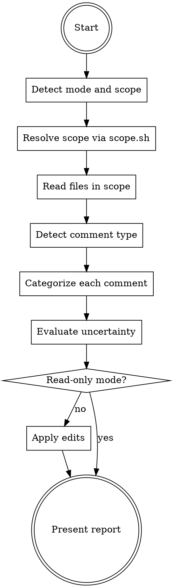

# Writing Code Comments

Improve code comments toward "why not what": remove redundant comments, improve vague ones, condense verbose ones, preserve valuable ones, and flag inconsistent ones.

**Output scope:** In the default mode, applies edits to comment text in the resolved scope. In read-only mode, reports the same findings without editing. Never touches non-comment code; never auto-removes a flagged comment.

**Documentation surface:** When `docs.surface` is assigned, enforce it as an invariant — every piece of knowledge has one home. A comment holds only WHY local to the code beside it; knowledge a documentation surface owns is referenced from code, never restated. Default if not otherwise stated: no surface, and comments are judged on their own merits.

## Workflow

The workflow below can be extended by content earlier in context. Two shapes are recognized:

1. **Pre-Step / Post-Step instructions.** Before executing Step N, check whether earlier context contains a section headed `## Pre-Step-N`. If it does, execute its content as additional instructions, then continue with Step N. After Step N, do the same check for `## Post-Step-N`.
2. **Named-value assignments.** The skill body cites certain configuration values by backticked name alongside an inline default (for example `` `todo.ticket_format` ``). When such a name appears, check whether earlier context assigns a value to it. If yes, use the assigned value; otherwise use the inline default.

Both checks default to no-op. When earlier context contains no matching section or assignment, the skill runs entirely on the defaults documented inline.



### Step 1: Detect mode and scope

Set **read-only mode** when the request uses "check", "analyze", "audit", "review without editing", or "report only". Otherwise use the default editing mode.

Detect the scope type from the argument and normalize it for Step 2:

| Signal | Scope type | Spec passed to scope.sh |
|---|---|---|
| Empty argument | `path` | `.` |
| Path with `/` or an existing file/dir | `path` | the path(s) |
| `--git`, "my changes", "working tree", "branch vs main" | `git-worktree` | optional base ref (default `HEAD`) |
| A single SHA or `HEAD`, `HEAD~N`, branch name | `commit` | the ref |
| A range with `..` or `...` | `commit-range` | the range verbatim |
| Two or more space-separated SHAs | `commit-list` | the SHAs |

### Step 2: Resolve scope

Run the scope script by its **absolute path** while keeping the working directory **inside the repository being reviewed** (git scopes resolve against the current repository):

```
bash <skill-dir>/scripts/scope.sh <type> <spec...>
```

The script prints one `FILE <path> <ranges>` line per in-scope file. `<ranges>` is `-` for path scope (review the whole file) or comma-separated added-line ranges `a-b,c-d` for git scopes (review only those lines). It applies a built-in skip set (vendored, generated, and lock files).

Exit-code handling:

- `0`: success, proceed.
- `1`: no in-scope files. Report it and stop.
- `2`: invalid arguments or not inside a git repository. Report the script's stderr verbatim and stop.

After reading the manifest, drop any file matching `paths.ignore`. Default if not otherwise stated: the script's built-in skip set only (no project additions).

### Step 3: Read files in scope

Read each in-scope file before categorizing — surrounding code is the source of truth for whether a comment is redundant, vague, or inconsistent. For git scopes, restrict categorization to comments on or adjacent to the manifest's line ranges; for path scope, consider every comment.

Skip any comment matching `comments.exemption_markers` entirely. Default if not otherwise stated: no exemption markers.

For large scopes, batch files and use `TodoWrite` to track progress.

When `docs.surface` is assigned, treat it as the canonical map of where project knowledge lives; read a named local surface document on demand only to confirm whether a comment's content is already documented. Load `references/documentation-surface.md` for the adherence procedure.

### Step 4: Detect comment type

Classify each comment before categorizing:

- **Implementation comment** — any non-contract comment (`//`, `/* */`, `#`, `<!-- -->`, `{# #}`, `--`). Treatment: remove if obvious, improve if vague, condense if verbose.
- **API documentation** — contract docs before a declaration with structured tags (`@param`/`@return`, docblock/docstring syntax). Treatment: condense to purpose + non-obvious contract only.

**Visibility rule:** structured docs on a public or protected declaration are API contracts; on a private declaration they are implementation comments. Load `references/api-docs.md` when API documentation is present or visibility is unclear.

### Step 5: Categorize each comment

Assign exactly one action per comment:

- **Remove** — restates the code, names the symbol, or describes an obvious operation, and carries no content signal. See `references/removal-patterns.md`.
- **Improve** (implementation comments only) — vague WHAT with no WHY; add the business rule, constraint, workaround, or design reason. When `docs.surface` is assigned, keep the improvement local and reference the owning surface instead of inlining doc-level content. See `references/improvement-examples.md`.
- **Condense** — preserves WHY but is verbose. Implementation: see `references/implementation-comment-condensation.md`. API docs: see `references/api-docs.md`.
- **Preserve** — external references, algorithm/performance rationale, security warnings, workarounds with bug numbers, contextualized TODOs, design trade-offs. See `references/preservation-guidelines.md`. Always preserve comments matching `comments.preserve_patterns`. Default if not otherwise stated: no preserve patterns.
- **Flag** — inconsistent with code (wrong behavior, return, name, exception handling) or an incomplete marker. Flag a `TODO`/`FIXME` that does not match `todo.ticket_format`. Default if not otherwise stated: flag any TODO/FIXME lacking an owner or ticket reference. See `references/consistency-checking.md`. Never auto-edit or auto-remove a flagged comment.
- **Relocate** (only when `docs.surface` is assigned) — the comment holds knowledge the surface owns, not local WHY. If the surface already documents it, condense the comment to a reference to that location; if it does not, flag the comment for migration to the named surface. Never auto-remove it and never write to the surface document. See `references/documentation-surface.md`.

Verify code-comment consistency first: an inconsistent comment is worse than a missing one. When unsure between Remove and Preserve, preserve and flag for review. For legacy code, algorithms, and generated files, see `references/special-cases.md`.

### Step 6: Evaluate uncertainty

For each Remove/Improve/Condense, rate the risk of discarding valuable information as HIGH, MEDIUM, or LOW using lightweight heuristics: a change is likely HIGH/MEDIUM when it removes a content signal (external reference, constraint, example, rationale, trade-off, framework behavior, or domain term), touches a file matching `paths.conservative`, or changes a term in `domain.terms`. Defaults if not otherwise stated: no conservative paths, no domain terms.

When a potential HIGH/MEDIUM is detected, load `references/uncertainty-patterns.md` for the full classification and verification-prompt templates. Track each HIGH/MEDIUM item — file, line range, change, reason, and a specific verification prompt — for the report. LOW-only changes are routine and need no tracking.

### Step 7: Apply edits

Skip this step entirely in read-only mode.

Apply one `Edit` per change with an exact `old_string` match; include surrounding lines when the comment text is not unique. Preserve indentation and delimiter style. A Relocate-to-reference outcome is an ordinary edit; do not edit flagged comments or comments flagged for migration. If an edit fails, report the file and line and continue with the rest.

### Step 8: Present report

Report format (scale verbosity to scope: per-line detail for small scopes, summary-only for large ones):

```markdown
## Code Comment Review — <scope>

**<file>**
- Line N: Removed "<comment>" (<reason>)
- Line N: Improved "<old>" → "<new>" (<reason>)
- Line N: Condensed <comment> (<reason>)
- Line N: Preserved "<comment>" (<reason>)
- Line N: Flagged "<comment>" (<reason>)
- Line N: Relocated "<comment>" → see <doc> (or: flagged to migrate to <doc>)

### Changes Requiring Verification ⚠️
#### High Priority
1. **<file>:<lines>** — Change: <what> · Uncertainty: <why> · Verify: <actionable check>
#### Medium Priority
2. ...

### Summary
- Removed / Improved / Condensed / Preserved / Flagged / Relocated: <counts>
- Files changed: <n> · Changes requiring verification: <n> (<h> HIGH, <m> MEDIUM)
```

Omit the "Changes Requiring Verification" section when no HIGH/MEDIUM items exist. When `docs.surface` is assigned, group the Relocate outcomes (referenced vs flagged-for-migration) and name the surface entry for each. In read-only mode, present the same findings as proposals (nothing was edited).

## Recognized Named Values

| Name | Default | Effect |
|---|---|---|
| `paths.ignore` | (script skip set only) | Extra globs dropped from the scope manifest before review. |
| `paths.conservative` | (none) | Files requiring extra caution; substantive changes there are at least MEDIUM uncertainty. |
| `comments.preserve_patterns` | (none) | Regexes/markers whose matching comments are always preserved. |
| `comments.exemption_markers` | (none) | Markers whose comments are skipped entirely. |
| `todo.ticket_format` | (none) | Regex a TODO/FIXME must match to avoid being flagged. |
| `domain.terms` | (none) | Domain terms whose alteration raises change uncertainty. |
| `docs.surface` | (none) | The project's documentation surface: where each kind of knowledge lives, plus the invariant that comments hold only local WHY. Drives the Relocate action. |
