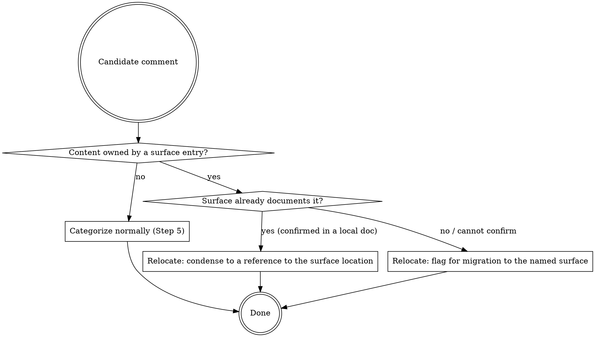

# Documentation Surface

How to read a `docs.surface` value and enforce it as an invariant during comment work. Loaded when `docs.surface` is assigned.

## What a `docs.surface` value contains

A `docs.surface` value describes the project's **documentation surface** — the places, other than code comments, where project knowledge lives — and the **invariant** that governs the split:

- A **map**: each surface entry is a location (a file, glob, or named external resource) plus a statement of what kind of knowledge it owns (architectural decisions, public API contracts, setup, process, …).
- An **invariant**: the global rule that each piece of knowledge has exactly one home. A code comment holds only WHY that is *local to the code beside it*; anything a surface owns is referenced from code, never restated.

The value may also point at the project's own documentation map (for example "see `docs/README.md` for the surface") instead of restating it inline.

**Inspection limit:** the skill can read **local** surface files (files, globs) to confirm coverage. An external surface (a wiki, Confluence, a URL) can be *named* — comments are deferred or flagged to it — but its content cannot be read, so coverage there cannot be confirmed; flag rather than assume.

## Adherence Decision (per comment)



**Content owned by a surface entry?** A comment's content is *owned by the surface* when it carries knowledge an entry claims — cross-module architecture, a design decision and its rationale, a public contract beyond a one-line purpose, setup or process. It is *not* surface-owned when it explains WHY this specific line, branch, or workaround exists. Local WHY stays in code; categorize it normally (remove / improve / condense / preserve / flag).

**Surface already documents it?** Read the relevant local surface document and check whether the knowledge is genuinely present there. Confirm before reducing a comment to a reference; do not assume coverage you have not seen.

**Relocate → reference.** When the surface already documents the content, condense the comment to a pointer at the owning location and keep any local WHY that remains:

```php
// before
// We dispatch through the queue rather than calling the service directly so a
// downstream outage cannot block checkout; this was decided after the 2023
// incident and trades latency for isolation. See ADR for the full analysis.

// after (the decision lives in the ADR; the comment references it)
// Queue-dispatched to isolate checkout from downstream outages — see docs/adr/0007.
```

**Relocate → migrate.** When the surface owns the content but does not yet document it (or it lives in an external surface that cannot be read), flag the comment for migration to the named surface. Never delete it and never write to the surface document — relocation of the text itself is the author's action.

## How the invariant modulates the other actions

- **Improve** — add only local WHY. For rationale a surface owns, add a reference to that surface rather than inlining a doc-level explanation.
- **Condense** — a comment that restates a documented fact condenses to a reference, not a shorter restatement.
- **Preserve** — preserve a comment when it is local WHY. A comment that is surface-owned is not "preserve as-is"; it is a Relocate (reference or migrate).

## Example surface value

```
- `docs.surface` =
    Documentation surface — the single home for each kind of knowledge:
    - `docs/adr/*.md` — architectural decisions and rationale. Code references the ADR id; never restates the decision.
    - `docs/api/**` — published API contracts. Public/protected docblocks defer here beyond a one-line purpose.
    - `README.md`, `docs/setup.md` — install, configuration, usage. Never duplicated in comments.
    Invariant: a comment holds only WHY local to the code beside it. Any knowledge a surface above owns lives there once and is referenced from code.
```
