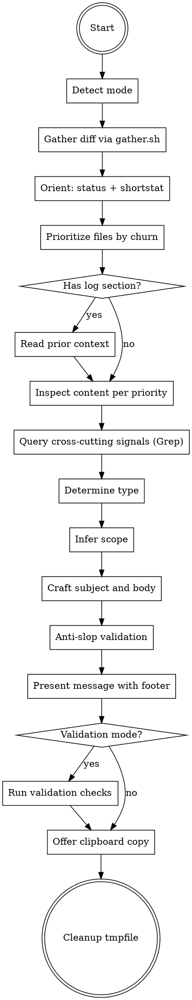

# Writing Commit Messages

Generate and validate Conventional Commits with a mode-aware, gather-script-driven workflow.

**Output scope:** Presents formatted commit message text. Does not create commits, write files, or modify git state.

## Workflow

The workflow below can be extended by content earlier in context. Two shapes are recognized:

1. **Pre-Step / Post-Step instructions.** Before executing Step N, check whether earlier context contains a section headed `## Pre-Step-N`. If it does, execute its content as additional instructions, then continue with Step N. After Step N, do the same check for `## Post-Step-N`.
2. **Named-value assignments.** The skill body cites certain configuration values by backticked name alongside an inline default (for example `` `subject.max_length` `` with default `72`). When such a name appears, check whether earlier context assigns a value to it. If yes, use the assigned value; otherwise use the inline default.

Both checks default to no-op. When earlier context contains no matching section or assignment, the skill runs entirely on the defaults documented inline.



### Step 1: Detect mode

The skill picks one mode in this order. No slash commands.

1. Argument is a full or short SHA → **rewrite** mode (range = `<sha>^..<sha>`).
2. Argument is a range expression (`<a>..<b>` or `<a>...<b>`) → **squash** mode (range as-is).
3. User message mentions "rewrite", "reword", or "amend" without an explicit ref → **rewrite** mode (ref = `HEAD`).
4. User message mentions "squash", "branch", "PR", or asks for a summary of a branch → **squash** mode. Base ref is `modes.squash.default_base`; default if not otherwise stated: `main`.
5. Otherwise → **staged** mode (range = `--cached`; fall back to working tree `git diff` if `--cached` returns empty).

Detection of "validate", "check", "verify", or "is this commit message correct" sets **validation mode** as an additional flag on top of rewrite or squash mode. Validation mode requires an explicit ref.

### Step 2: Gather diff material

Run the gather script: `scripts/gather.sh <range>`.

The range depends on mode:

| Mode | Range |
|---|---|
| staged | `--cached` (or empty for working-tree fallback) |
| squash | `<base>..HEAD` |
| rewrite | `<sha>^..<sha>` |

Record the `TMPFILE` path and TOC printed on stdout. Each TOC entry has the form `SECTION <name> <start>-<end>`. Sections whose range is inverted (`start > end`) are empty; skip them.

Exit-code handling:

- `0`: success, proceed.
- `1`: no changes. For staged mode, retry with empty range. For squash mode, report "branch has no commits ahead of base" and stop. For rewrite mode, report "hash resolves to no changes" and stop.
- `2`: invalid range. Report stderr message to the user and stop.

### Step 3: Orient

Read the `plugins`, `status`, and `shortstat` sections together with one `Read` call. This loads the file change list with rename detection and the one-line summary.

### Step 4: Prioritize

Read the `numstat` section. Rank files by churn (added + deleted lines) and status (Modified > Added > Renamed > Deleted) to identify which files need semantic inspection in Step 6.

### Step 5: Read prior context

Run only when the TOC contains a `log` section (squash and rewrite modes; staged mode skips).

Read the `log` section. Each commit entry has format:

```
<sha>
<subject>
<body lines>
---
```

- **Squash mode:** per-commit subjects and bodies seed the draft body. Draft the summary from subjects first; later steps verify and fill gaps.
- **Rewrite mode:** the existing commit message is a starting reference, but base the new type and scope purely on the diff content (Step 6 onward).

### Step 6: Inspect content

For each file the draft will make a specific claim about, read the corresponding `DIFF_FILE` range from the TOC. Use `Read` with `offset = mark_start`, `limit = mark_end - mark_start + 1`.

Every sentence in the subject and body must be traceable to a hunk read here. Content is the source of truth; do not infer behavior from file paths or change counts alone.

Prioritize files in Step 4's order. Stop reading once you have enough evidence for the type, scope, and subject. Typically: top 1-3 highest-churn files for staged/rewrite, top 3-7 for squash.

### Step 7: Query signals

Use `Grep` with `path=$TMPFILE` for cross-cutting checks that don't belong to one file:

- Removed exported symbols: `^-func `, `^-type `, `^-class `, `^-export `, `^-pub fn `
- Breaking change markers in text: `BREAKING`, `breaking change`
- Specific identifiers mentioned in the draft (verify they actually appear in the diff)

Grep keeps the diff authoritative while loading only matched lines.

### Step 8: Determine type

Apply the decision tree in `references/type-detection.md`.

Confidence handling:

- HIGH / MEDIUM: use type directly.
- LOW: use `AskUserQuestion` with options derived from the analysis.

Detect breaking-change indicators from Step 7 and from API-shape diffs in Step 6.

### Step 9: Infer scope

Determine scope from the file list (from Step 3's `status` section). Universal default: the immediate top-level directory of changed files is the scope. When changes span multiple directories, choose the one with the most files; ties prefer the directory with the most line churn. Omit scope when changes are repository-wide or when no single directory dominates.

Check the resolved scope against `scope.naming_convention`. Default if not otherwise stated: `kebab-case` (matches `[a-z0-9-]+`).

Confidence handling:

- HIGH / MEDIUM: use scope directly.
- LOW: use `AskUserQuestion`.

### Step 10: Craft subject and body

**Subject rules:**

- Imperative mood, present tense ("add", not "added").
- Lowercase first word after the colon.
- No period at end.
- Hard cap: `subject.max_length` characters including the `type(scope): ` prefix. Default if not otherwise stated: `72`.
- Specific: name the component and behavior, not abstract descriptions.
- No PR number in subject.
- No AI/tool attribution.

**Body rules** (when a body is included):

- Blank line between subject and body.
- Single continuous lines per paragraph (no hard-wrapping at 72).
- WHY-not-WHAT: motivation, root cause, trade-offs.
- Concrete: class names, config keys, method signatures.
- For breaking changes: include a `BREAKING CHANGE:` footer. When a breaking-change footer is emitted, append `body.breaking_change_handoff` to the body. Default if not otherwise stated: include migration instructions inline.

**Squash body:** describe the branch's purpose grouped by logical concern, not by commit order. Each Step 5 commit contributes a candidate concern; merge overlapping ones.

**Rewrite body:** if the existing message had a body and Step 6 inspection confirms its claims, preserve substance; otherwise rewrite.

### Step 11: Anti-slop validation

Re-read `references/writing-rules-anti-ai-slop.md`, then check the draft message literally (not from memory):

1. Check each body paragraph for hard-wrapping. Join multi-line paragraphs into a single continuous line. The 72-char limit applies only to the subject.
2. Search subject and body for em dash (`—`) and en dash (`–`) characters. Remove every instance. This is a literal character search, not a mental scan.
3. Re-read each word against the banned vocabulary list. Replace matches with the plain alternative or delete.
4. Check for banned sentence patterns, colon overuse, hedging filler.
5. If violations are found, rewrite the affected text and re-check the rewritten text.

### Step 12: Present message with footer

Quick self-check: type matches changes, scope matches files, subject is accurate.

**Output:**

1. Brief analysis (type reasoning, scope reasoning, breaking-change note if any).
2. The commit message in a fenced code block.

**Message format:**

```
type(scope): subject

body (when a body is included)

BREAKING CHANGE: description (when breaking)
<footer lines>
```

**Footer:** emit `footer.template` with `{model}` substituted by the active model's name (e.g., `Opus 4.7 (1M context)`, `Sonnet 4.6`). Default if not otherwise stated: `Co-Authored-By: Claude {model} <noreply@anthropic.com>`. If `footer.template` is the empty string, suppress the template line.

After the template line, emit each entry of `footer.extra_lines` on its own line. Default if not otherwise stated: no extra lines.

Do NOT include PR references like `(#N)` in the subject. GitHub adds these during merge.

### Step V: Validation checks

Run only in validation mode. Reuse Steps 2-7 (gather, orient, inspect, grep) to build the "what the commit should say" baseline.

Apply checks per `references/validation-rules.md`.

Report verdict per category, then overall. Optionally generate a rewrite suggestion (Steps 8-12 against the actual diff) and present side-by-side.

### Step 13: Offer clipboard copy

Ask the user whether to copy the generated message to the clipboard. If they accept, use the `clipboard_copy` MCP tool (or `pbcopy` / `xclip` fallback if MCP is unavailable). Copy only the message content; do not include the surrounding code fence markers.

In validation mode, the offer applies to the rewrite suggestion (if generated), not the report.

### Step 14: Cleanup

Delete the tmpfile as the final action, regardless of outcome:

```
rm -f "$TMPFILE"
```

This step runs on every termination path, including error exits from earlier steps.
