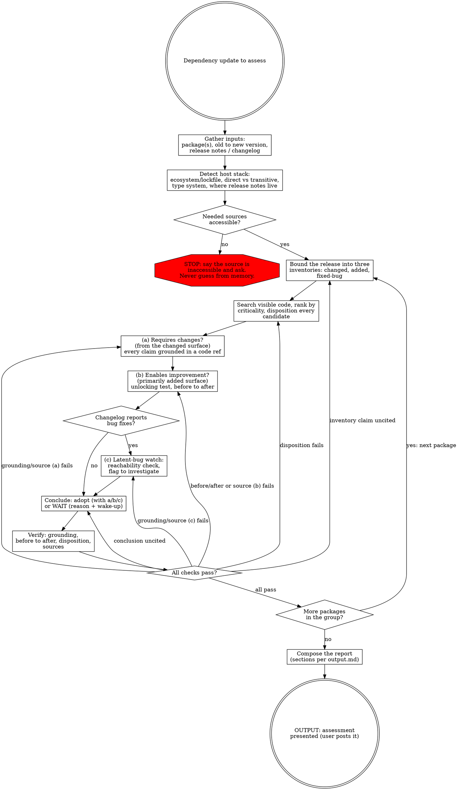

# Triaging a Dependency Update

Assess one dependency update and report whether it requires changes, enables improvements, or surfaces a latent bug. The assessment is read-only: investigate and report, never modify code, the lockfile, the dependency graph, or git state.

**Output scope:** Produces an assessment presented to the user, who decides where it goes.

A grouped update that bumps several packages is assessed per-package under one report: Steps 4–10 run once per package; Step 11 composes once.

## Operating rules

These hold throughout the workflow.

1. **Read-only, always.** Investigate and report. Never edit code, mutate the lockfile or dependency graph, or commit. If adopting the update would genuinely require a new dependency, report that and stop; do not add it.
2. **Ground every "this affects us" claim in a real code reference.** Search the visible host code for uses of the changed behavior. The changelog alone is never evidence that the application is affected.
3. **Surface an improvement only with a concrete before→after.** No speculative "could be nice."
4. **A non-mandatory update may wait.** When adoption is not warranted, recommend WAIT, state the upstream reason, and name the wake-up condition (the future event that flips the recommendation).
5. **Cite sources; never fabricate.** Every claim drawn from release notes or web research names its source inline. If a needed changelog or source is inaccessible, say so and ask; never substitute a guess from memory.

## Workflow

### Step 1: Gather inputs

Identify the package or packages, the old to new version, and the release notes or changelog. Take the update from wherever it arrives: a plain user request, a manual version bump, a lockfile change under review, or an update PR. When a forge PR exists, read its body and diff through the available git-forge tooling. When the changelog is not in the PR, identify where it likely lives; it is fetched after Step 2 resolves the release-notes location and Step 3 confirms access. Detect the update source rather than assuming one exists. A grouped update is assessed per-package.

### Step 2: Detect the host stack

Apply `references/detection.md` to detect the host stack: ecosystem and package manager, the updated package's directness, the type system, the gate commands, and where release notes live. The project's own files are the source of truth; assume no ecosystem, forge, or bot.

### Step 3: Confirm sources are accessible

With the release-notes location resolved, confirm the changelog and any migration notes the assessment depends on are readable. If a needed source is blocked or missing, STOP: state which source is inaccessible and what you attempted, and ask the user to provide it or grant access. Do not proceed with a guess from memory.

### Step 4: Bound the release into three inventories

Do not read the whole diff. Apply `references/investigation.md` to bound the release into its three inventories (changed surface, added surface, fixed-bug list); each prong reads its own inventory first. Judge whether the changelog enumerates changes at entry level; when it does not, record the non-enumeration as a limitation for the report's Not fully verified section.

### Step 5: Search, rank, disposition

Run the engine from the reference loaded in Step 4 over every candidate: search the visible code, rank by criticality, verify the top-ranked in depth, and disposition each one, surfacing the unverified as limitations. Route the fan-out per its model tiers; the driver adjudicates each finding against its returned evidence.

### Step 6: Prong (a), does it require changes?

Apply prong (a), from the reference loaded in Step 4, to the changed surface: decide what the update forces us to change across code, tests, docs, config, and pipeline, grounding every claim in a real code reference.

### Step 7: Prong (b), does it enable an improvement?

Apply prong (b), from the same reference, primarily to the added surface plus limitation-removing entries from the other inventories: find a change the update unlocks that makes our code simpler, safer, more correct, or better tested, each surfaced only with a concrete before→after.

### Step 8: Prong (c), latent-bug watch

When the fixed-bug list is non-empty, apply prong (c) from the same reference: check each fixed bug for reachability into the application, and flag a plausible one as an item to investigate, not a verdict. An empty fixed-bug list from a changelog that reports fixes without enumerating them is a limitation to report, not evidence that nothing was fixed.

### Step 9: Conclude, adopt or wait

State a recommendation: adopt, carrying the prong (a), (b), and (c) findings, or WAIT with the upstream reason and the wake-up condition. Either recommendation carries every unverified-candidate limitation.

### Step 10: Verify (quality gate)

Before composing, run four checks over the assessment:

**Grounding.** Every prong-(a) required change and every prong-(c) reachability flag cites a real code reference, not the changelog alone.

**Before→after.** Every prong-(b) improvement carries a concrete before→after.

**Disposition.** Every candidate is dispositioned; unverified candidates appear as limitations, and no unconditional "no changes needed" rests on one.

**Sources.** Every claim drawn from release notes or web research names its source.

Failure edges: an ungrounded or uncited claim returns to the step that introduced it (Step 4 for an inventory claim; Step 6, 7, or 8 for a prong claim; Step 9 for the conclusion); a missing before→after returns to Step 7; an undispositioned candidate returns to Step 5. Re-run the gate after fixing; compose only when all four pass for every package.

### Step 11: Compose and present

Compose the report to the shape in `references/output.md` and present it to the user; never post to the forge automatically. Apply the reference's companion-degradation rules when a companion is missing.
