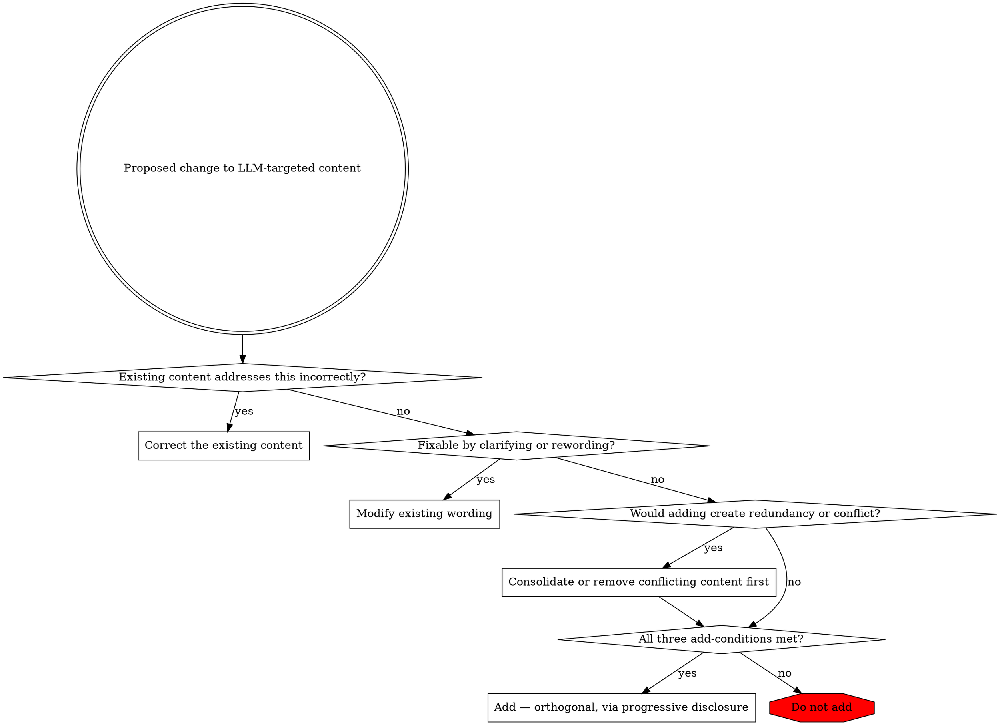

# Content Editing for LLM

Enforce the principle: **prefer correcting existing content over adding new instructions**.

## Core Principle

Undesired behavior stems from **incorrect** information, not missing information. Shorter is better.

## Decision Framework

Walk the checks in order.

- **Existing content addresses this incorrectly?** Undesired behavior usually traces to a wrong instruction, not a missing one — correct that instruction.
- **Fixable by clarifying or rewording?** A vague or ambiguous instruction is modified in place, not supplemented.
- **Would adding create redundancy or conflict?** Consolidate or remove the conflicting guidance first.

Add new content only when **all three** hold: the capability genuinely doesn't exist, existing content cannot reasonably be extended, and the addition is a distinct, orthogonal concern. Otherwise, do not add.

## When Addition is Warranted

If adding is truly necessary:
- Consider **progressive disclosure** — move detailed content to `references/`
- Consider **agent delegation** — split responsibilities into focused agents
- Keep additions **orthogonal** — distinct from existing content

Additions are appropriate when they fill genuine gaps.
