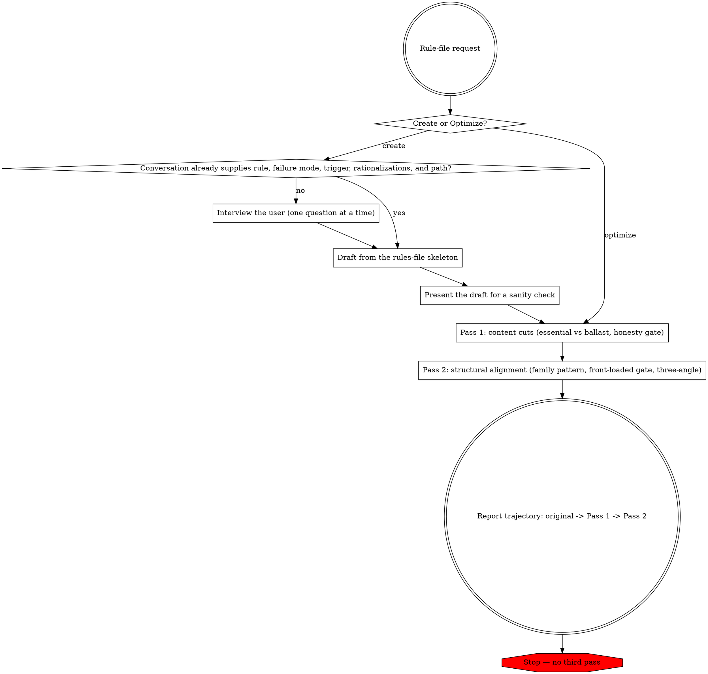

# Rule-File Writing and Optimization

## Core Principle

A **rule file** is an instruction file that an AI coding assistant automatically loads for a matching user, project, or directory scope. It supplies persistent behavioral steering rather than a task-specific workflow.

Rule files are context tax paid whenever their scope matches. Optimize for behavioral steering per token: keep what changes generation, cut what justifies the rule to a human reader.

This skill covers **rule files only**. For skills, agents, or commands, use the corresponding authoring workflow. For SKILL.md or agent content, defer to `content-editing`.

## Workflow

Create flows into Optimize: draft, present, then run the two fixed passes. Mode detection, per-step substance, and the honest-reporting rule are elaborated below.

## Mode Detection

- **Create** — triggers: "write a rule about X", "create a rules file", "add a rule for Y", or any request that names a rule without pointing at an existing file. Interview the user (or skip if the conversation already supplies the content), then draft from the template using the active assistant's rule-file convention.
- **Optimize** — triggers: "optimize this rules file", "cut ballast from this rule file", "clean up this rule", or any invocation that supplies a path to an existing rule file. Run the two-pass loop.

## Create Workflow

### Step 1: Interview

Skip this step if the conversation already contains (a) the rule, (b) the failure mode it prevents, (c) the triggering action, (d) plausible bypass rationalizations, and (e) the target path.

Otherwise ask the user one question at a time, with multiple-choice options where possible:

1. Rule in one sentence → `CRITICAL` opener.
2. Triggering action → `Decision Test` heading.
3. 2–4 WRONG/CORRECT pairs → body code block. Skip if the rule has no syntactic form.
4. 2–4 bypass rationalizations → Red Flags table.
5. Allowed exceptions → gated escape hatch section. Omit if none.
6. Target path and scope. Use the active assistant's documented rule-file convention; do not invent a location.

### Step 2: Draft From Template

1. Read `assets/templates/rules-file-skeleton.md`.
2. Fill slots from interview answers or conversation context.
3. Remove `## Banned Patterns` if the rule has no syntactic form.
4. Remove `{{OPTIONAL_ALLOWED_EXCEPTIONS_SECTION}}` if there are no exceptions — no empty heading.
5. Default `{{BODY_SECTION_TITLE}}` to `## Core Rules` unless a more specific frame applies.
6. Save to the target path.

Minimum viable output: CRITICAL opener + Decision Test + body + Red Flags.

### Step 3: Present

Show the draft to the user for a sanity check before entering the optimize workflow.

## Optimize Workflow

Two fixed passes. No third pass — if the user wants more, they re-invoke.

### Pass 1: Content Cuts

1. Read `references/essential-vs-ballast.md` for the classification tables and the per-paragraph decision test.
2. Read the target file end-to-end.
3. Classify each paragraph/bullet as essential or ballast. Apply the calibrated-honesty gate from the reference to every proposed cut.
4. Apply cuts. Report the word-count delta.

### Pass 2: Structural Alignment

1. Read `references/techniques.md` and `references/three-angle-pattern.md`.
2. Run the Pass 2 scan checklist from `techniques.md` (family-pattern order, front-loaded decision gate, code-block framing, WHY clauses, explicit gate conditions).
3. Apply the three-angle check. Add missing angles only to bypass-prone rules, never to non-rationalizable ones.
4. Apply edits. Report the trajectory: `original → Pass 1 → Pass 2`.

## Honest Reporting

If two passes produce minimal cuts, report 0% and stop. Manufactured cuts are banned — the calibrated-honesty gate in `essential-vs-ballast.md` enforces this. Expected reduction ranges:

| File state | Expected Pass 1 + Pass 2 reduction |
|---|---|
| Heavy ballast (essay-style, citations, "why" sections) | 40–55% |
| Moderately tight | 10–25% |
| Already tight (authored with these principles) | 1.5–10% |
| Already optimal | 0% — report honestly |

## Error Handling

- Target is not an auto-loaded rule file for the active assistant → wrong skill; use the corresponding content-authoring workflow
- Target rules file does not exist and no content is provided → run Step 1 (Interview)
- Target path is not recognized by the active assistant's rule discovery conventions → confirm the path before writing
