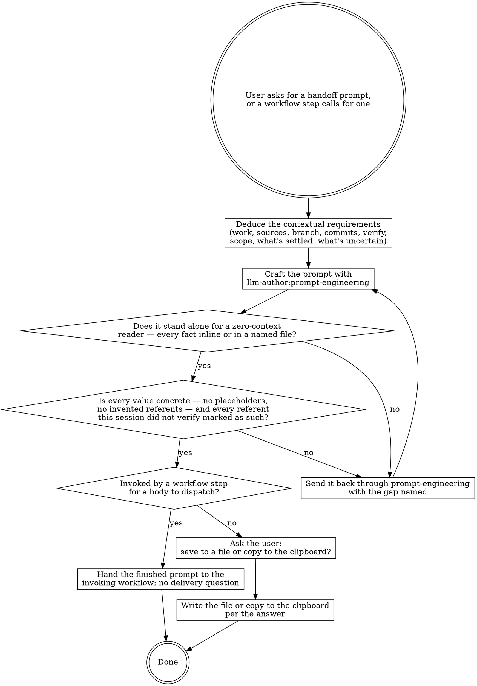

# Writing Handoff Prompts

The receiving session starts with **zero context**: everything it needs must be in the prompt or in a file the prompt names. Hand off *state, not a transcript* — the operational facts the next session acts on, not the conversation that produced them. Work from this session's context — do not gather new scope. Reading a source to check a referent the prompt already cites is verification, not scope. Craft the prompt with the `llm-author:prompt-engineering` skill, scale its detail to the size of the work, then deliver it per the recipient: handed back to an invoking workflow, offered to the user otherwise.

## Deduce the contextual requirements

Read the current session and the user's request, then settle each dimension from what this session actually did. If the user's request fixes a dimension, follow it exactly; otherwise take the most grounded default.

| Dimension | Resolve from context |
|---|---|
| **Work type** | What the receiver must do: implement a spec, apply review or report fixes, turn review findings into a proposal (re-verify each finding, propose concrete changes, then wait for approval), continue an analysis, or hand off the next phase. |
| **Authoritative sources** | The file(s) that are the contract (spec, review, report, plan) plus the convention, naming, and reference files the receiver must obey. |
| **Branch** | Stay on the current branch, or create a new one and off which base. |
| **Commit policy** | Single commit, one per change bundle, or a fixed count; title-only or full; which skill writes the messages; what must never be staged. |
| **Verification** | The tooling and tests to run and when (before each commit, before done) — mirror what this session used. |
| **Scope** | What is in scope, and explicitly what is out. |
| **Settled vs open** | The decisions already locked, and the open choices the receiver should surface up front rather than guess. |
| **Uncertain** | What this session could not verify or is unsure about, so the receiver re-checks it rather than trusting it. |

## What the handoff must contain

This is the specification you hand to the crafting skill. Include each section the deduced work type needs, in this order. When a workflow step invoked this skill and declares that its own wrapper blocks own a section's content — an escalation boundary, a report contract, receiver framing — omit that section from the body: the wrapper carries it, and a body that restates it contradicts the wrapper. Where the wrapper owns only part of a section's content — a definition of done whose reporting clause the wrapper carries — omit that part and keep the rest.

1. **Mission** — one sentence the receiver can hold the whole task against.
2. **Framing** — it is a fresh session; all context is in the prompt and the referenced files; it should read them first and not re-derive the design.
3. **First action** — the single unambiguous first move (read the spec in full; verify the current branch before editing).
4. **Required reading** — an ordered list; each entry is a file path plus what it authoritatively holds (the contract; the review or report; naming and convention docs; the reference implementation to mirror).
5. **Branch** — where to work, and how to create the branch when it is new.
6. **Build order** — the work as atomic, independently committable units or bundles, in order. Pin each unit to its contract citation, and mark cited `file:line` locations as entry points to re-read before editing, since they drift as commits land.
7. **What is settled, what is open** — the locked decisions and already-verified-sound points the receiver must not re-litigate, and the open questions it should surface up front rather than guess.
8. **Trust the code, not this prompt** — direct the receiver to treat each cited finding or assumption as a hypothesis to re-verify against current code, and call out the known traps this session hit so the receiver does not rediscover them. Label any connective claim this handoff adds that no source states as an author premise the receiver verifies before building on it.
9. **Engineering discipline** — the per-change conventions and the verification or tooling gate, exactly as this session applied them; push noisy work (large reads, independent reviews) into subagents to keep the receiver's context clean.
10. **Commit discipline** — commit granularity, where the messages come from, explicit-pathspec staging, and what must never be staged.
11. **Scope** — the in-scope work and, just as explicitly, the out-of-scope items.
12. **Escalation boundary** — the line between deciding autonomously and stopping to surface a question (an ambiguity, or a spec that no longer matches the code), and the requirement to get explicit user consent before any irreversible or shared-state action (push, PR, issue, deletion, deploy).
13. **Definition of done** — evidence-based, testable acceptance criteria the receiver confirms by running the check and showing real output, not by asserting it should work; then stop, report, and write a feedback note back to the originating session.

## Craft it with prompt-engineering

Invoke the `llm-author:prompt-engineering` skill to write the prompt. Give it as the specification: the dimensions you deduced and the section list above, plus these two standing constraints it must honor — the prompt stands alone for a zero-context reader, and every value in it is concrete, with every referent this session did not verify marked as such. Take its output as the draft, then run the two checks below.

## Make it stand alone for a zero-context reader

Reread the draft as the receiver — a session that knows only what the prompt says. For every decision, value, and rationale it relies on, confirm the prompt states it inline or points to a named file that holds it. Where the draft leans on shared memory ("the analysis we did", "the agreed approach"), name the gap and send it back through prompt-engineering with the statement or file reference supplied.

## Write concrete, real values

Take every commit hash, file path, class or symbol name, line number, and test count from this session's context, and write the exact value — not a vague placeholder ("the config file") and not an invented one that merely looks right. A referent this session has not itself verified — a path, symbol, or enumerated set written from recollection — is marked for the receiver to confirm rather than presented as fact. For anything this session does not hold, the prompt must tell the receiver how to obtain it — run the command, read the file. If you find a placeholder, an invented value, or an unmarked recollection, send the draft back through prompt-engineering to fix it.

## Hand the finished prompt to the invoking workflow

When a workflow step invoked this skill for a body to dispatch, the finished prompt is the deliverable to that workflow: state it in full and stop. The invoking workflow owns delivery — do not ask about files or the clipboard, and do not dispatch anything yourself.

## Ask how to deliver, then deliver

On a direct user request, present the finished prompt in your reply. Then ask whether to save it to a file or copy it to the clipboard — choose neither by default. Deliver it according to the answer.
