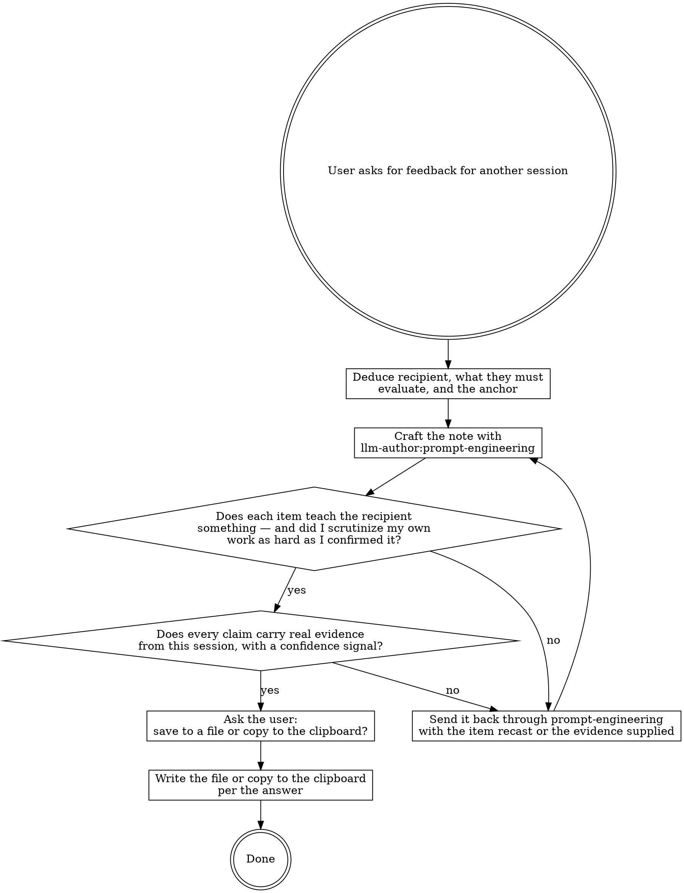

# Writing Session Feedback

Write **calibration feedback** for the upstream session that defined the work (it wrote the spec, performed the review, or made the plan): where execution diverged from its framing and why, where reading the code changed the reasoning, and what it under-specified — so its next spec or review is sharper.

You are reporting on your **own execution**, and a session reliably over-praises work it produced. Counter that: default to scrutiny, not approval; look as hard for what you got wrong, deviated on, or could not verify as for what you got right; and treat "it works" as a claim that needs evidence, not a conclusion. Address the recipient directly ("your spec", "you framed item 1.2 as…"), confirm what was sound and flag what was not, and anchor every claim to the concrete change. Work from this session's context alone. Craft the note with the `llm-author:prompt-engineering` skill, then offer to deliver it.

## Deduce the contextual requirements

| Dimension | Resolve from context |
|---|---|
| **Recipient** | The upstream session and its artifact: spec author, reviewer, or planner. |
| **What it evaluates** | Whether its artifact was implemented correctly, and how to make the next one sharper. |
| **Anchor** | The concrete change this session produced: branch, commit(s) or hash(es), what was and was not run, push state. |
| **Stance** | Calibrated and skeptical of your own work. The recipient is a peer to sharpen, not an audience to please; a note that is all confirmations is the self-praise failure, not calibration. |

## What the feedback must contain

This is the specification you hand to the crafting skill. Include each section that has content, and lead with the highest-signal divergences rather than the routine confirmations.

1. **Verdict** — one line up top: overall, whether the artifact was sound, and how much execution diverged from it.
2. **Header** — who the note is for and why (verify correctness, calibrate future work); the branch; the commit(s) or hash(es); the test, tooling, and push state.
3. **Implemented as specified** — the items that landed unchanged, kept brief; this is not where the value is.
4. **Diverged from your framing, with reasons** — where execution departed from the recipient's framing and why. This is the core of the note.
5. **Where verification changed the reasoning** — places where reading the actual code changed the rationale, even when the outcome was kept.
6. **Skipped** — the intentional non-actions and why, especially items the recipient marked optional.
7. **Under-specified by you** — the gaps execution had to fill, written as a generalizable lesson the recipient can apply next time (for example: "when a review item rests on a call-ordering assumption, state the ordering you assumed so the implementer can check it cheaply").
8. **Judgment calls to scrutinize** — the decisions the recipient should double-check, each tagged with how confident you are and what you could not verify, so the recipient can vary its scrutiny.
9. **Open questions back to you** — the places where execution wants the recipient's judgment rather than asserting an answer.
10. **Verification** — the real test counts as before/after deltas, and the evidence behind each "works" claim; name any check that was not run.
11. **Open items** — anything left for the user or the recipient to resolve.

## Craft it with prompt-engineering

Invoke the `llm-author:prompt-engineering` skill to write the note. Give it as the specification: the dimensions you deduced and the section list above, plus these standing constraints it must honor — every item earns its place by teaching the recipient something, your own work is scrutinized as hard as it is confirmed, and every claim carries real evidence and a confidence signal. Take its output as the draft, then run the two checks below.

## Keep every item a calibration

Reread each item and keep only those that tell the recipient something it could not already know from its own artifact — a divergence, a gap, a judgment call, a place its premise did not survive the code. Where an item is a bare confirmation, send the draft back through prompt-engineering to recast it as the lesson it carries or fold it into the brief "implemented as specified" line. Confirm you looked for your own mistakes as hard as your successes; an all-positive note is the self-praise failure, not feedback.

## Carry real evidence and a confidence signal

Take every commit hash, file path, symbol name, and test count from this session's context, and show verification as before/after deltas with the evidence behind each "works" claim. When a check was not run or a value is not known, say so plainly ("integration suite not run") rather than implying it passed. Mark each non-obvious claim with how sure you are, so the recipient scrutinizes the shaky ones and trusts the verified ones. If you find an invented anchor or an unsupported claim, send the draft back through prompt-engineering to correct it.

## Ask how to deliver, then deliver

Present the finished note in your reply. Then ask whether to save it to a file or copy it to the clipboard — choose neither by default. Deliver it according to the answer.
