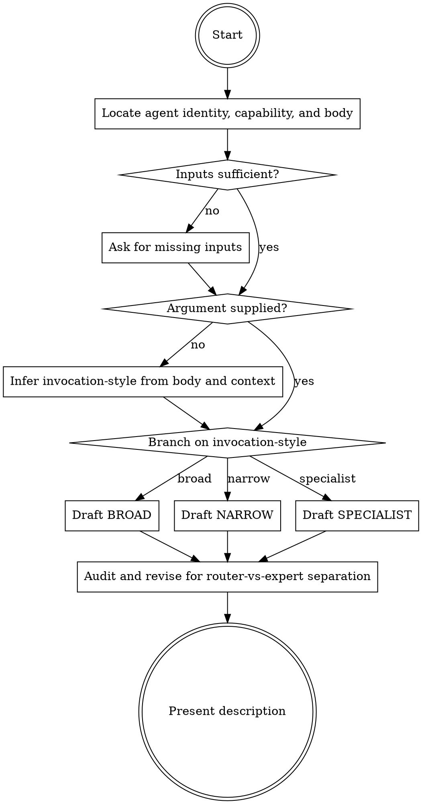

# Writing Subagent Descriptions

Author the `description` field of a Claude Code subagent so the orchestrator routes to it as intended. The description is consumed by the routing LLM, not by a human reader: optimize for routing accuracy, never for natural prose. Trigger tokens (`PROACTIVELY`, `MUST BE USED`), formulaic patterns, and dense phrasing are features, not slop.

**Output scope:** Presents a description string ready to paste into YAML frontmatter. Does not modify agent files in place unless the user asks for that after presentation.

## Argument

`<invocation-style>` controls trigger phrasing and breadth.

| Value | Trigger phrasing | Auto-delegation pressure | Negative space |
|---|---|---|---|
| `broad` | `Proactively …` / `Use proactively after <event>.` | High — wide routing net, accepts some false positives | None or minimal |
| `narrow` | `MUST BE USED when <condition>.` | Targeted — fires when conditions clearly match | Required (`Do NOT use for …`) |
| `specialist` | Capability + tight scope only, no trigger phrase | None — `@-mention` only | Optional |

If the argument is absent, infer from the body and surrounding context per Step 5.

## Workflow



### Step 1: Locate agent identity, capability, and body

Extract from the conversation, in priority order:

1. **Agent file in the working tree** — path mentioned, opened in the IDE, referenced in CLAUDE.md, or matched by `Glob` under `.claude/agents/`, `~/.claude/agents/`, or `plugins/*/agents/`. Read it; pull `name` from frontmatter and treat the body as the system prompt.
2. **Pasted draft** in the user message. Pull whichever fields are present.
3. **Verbal sketch** ("I want an agent that does X"). Treat the capability and intended workflow as the body source; surface gaps in Step 3.

The body is the most load-bearing input: it grounds the description in concrete capability, not a generic role label.

### Step 2: Inputs sufficient?

Sufficient means all three are present and specific enough to write trigger conditions against:

- **Name** in kebab-case.
- **Capability** as a one-sentence outcome (not a role title — "reviews staged Python diffs for type-hint compliance and unhandled exceptions", not "code reviewer").
- **Body** with at least: when-invoked behavior, output contract, and tool boundaries.

### Step 3: Ask for missing inputs

Use `AskUserQuestion`, one question at a time, for whichever of the three is missing or too generic. Offer multiple-choice options when the missing field is enumerable (e.g., capability framings derived from the body).

### Step 4: Argument supplied?

Check whether `<invocation-style>` was passed as the slash argument. Accept `broad`, `narrow`, or `specialist` exactly. Any other value: reject and ask the user to pick one or omit.

### Step 5: Infer invocation-style from body and context

If the argument is absent, classify from the body:

| Signal in body or surrounding context | Likely style |
|---|---|
| "When invoked" trigger is a recurring event (after writing code, after staging, on test failure) | `broad` |
| Tight output contract + restricted tool list + named scope exclusions | `narrow` |
| Body assumes the caller picked the agent; parameter-driven invocation with no auto-trigger heuristics | `specialist` |
| Fallback for "complex multi-step tasks when no specialist fits" | `specialist` (general-purpose pattern) |

If two signals conflict, default to `narrow` — it is the lowest-risk routing profile.

### Step 6: Branch on invocation-style

Dispatch to the matching draft step.

### Step 7: Draft BROAD

Form:

```
<Capability summary>. Proactively <user-vocabulary verbs> <object> <after|when|during> <event>. Use immediately after <upstream event>.
```

Rules:

- Lead with one or two user-vocabulary verbs the orchestrator will see in user prompts (`review`, `analyze`, `optimize`, `audit`, `generate`).
- Pair `Proactively` or `Use proactively` with a temporal or event trigger; never standalone.
- Omit or minimize negative space — broad styles want a wide routing net.
- One to three sentences.

Reference forms from Anthropic's official example agents:

- `Expert code review specialist. Proactively reviews code for quality, security, and maintainability. Use immediately after writing or modifying code.`
- `Debugging specialist for errors, test failures, and unexpected behavior. Use proactively when encountering any issues.`

### Step 8: Draft NARROW

Form:

```
<Capability summary>. MUST BE USED when <condition 1>, <condition 2>, or <condition 3>. Do NOT use for <exclusion 1>, <exclusion 2> — <one-line technical reason>.
```

Rules:

- Enumerate positive conditions as a numbered list or comma series.
- Always include negative space with a one-line technical reason. The reason gives the router something to weigh on near-matches.
- Mirror the user's likely phrasing. Specialized jargon shrinks the routing match surface.
- Two to four sentences.

### Step 9: Draft SPECIALIST

Form:

```
<Capability summary for <tight scope>>. <Invocation parameters and what each value selects, if any.>
```

Rules:

- No `PROACTIVELY` or `MUST BE USED`. The agent fires only on explicit invocation.
- State the scope tightly so the picker UI disambiguates it from neighbours.
- Document invocation parameters so the calling agent knows how to construct the prompt.
- One to two sentences.

### Step 10: Audit and revise for router-vs-expert separation

Check the draft and rewrite in place against these criteria. Do not run human-prose validators on the description — the artifact is consumed by the routing LLM, and human-readability passes can strip routing-critical tokens.

Reject and rewrite if the draft contains:

- Behavioural instructions to the agent itself (`You should …`, `Focus on …`, `Follow this workflow …`, `Provide feedback organized by priority`).
- Workflow steps (`When invoked, 1. …, 2. …`).
- Output-contract details (return schemas, formatting rules).
- Second-person subjects referring to the agent rather than the orchestrator's situation.
- More than four sentences.

Preserve, even if they would fail human-prose checks:

- `PROACTIVELY`, `MUST BE USED`, and similar uppercase trigger tokens.
- Em-dashes, colons, and semicolons separating clauses.
- Formulaic patterns such as `Do NOT use for …` and comma-listed condition enumerations.

Behavioural content belongs in the agent body. The description speaks **about** the agent **to** the router. If any router-vs-expert violations are present, move them to the body (or note they need to be added there) and rewrite the description.

### Step 11: Present description

Output:

1. The final description as a fenced YAML snippet, ready to paste:

   ```yaml
   description: <text>
   ```

2. Chosen invocation-style and a one-line justification — `explicit` if argument-supplied, `inferred-from-<signal>` if not.
3. If invocation-style is `broad`, append a one-line nudge: For reliable auto-delegation, also reference this agent in `CLAUDE.md` (`Use <name> when …`). Description signal alone leaves the routing rate below 100%.

## Error Handling

- Body describes a skill, command, or rules file rather than an agent → wrong skill; defer to `prompt-engineering` (skills, commands) or `rule-file-writing` (rules files).
- Body describes a workflow that crosses two distinct domains → suggest splitting into two agents before drafting; one agent, one description.
- `<invocation-style>` value is anything other than `broad`, `narrow`, or `specialist` → reject and ask the user to pick one or omit.