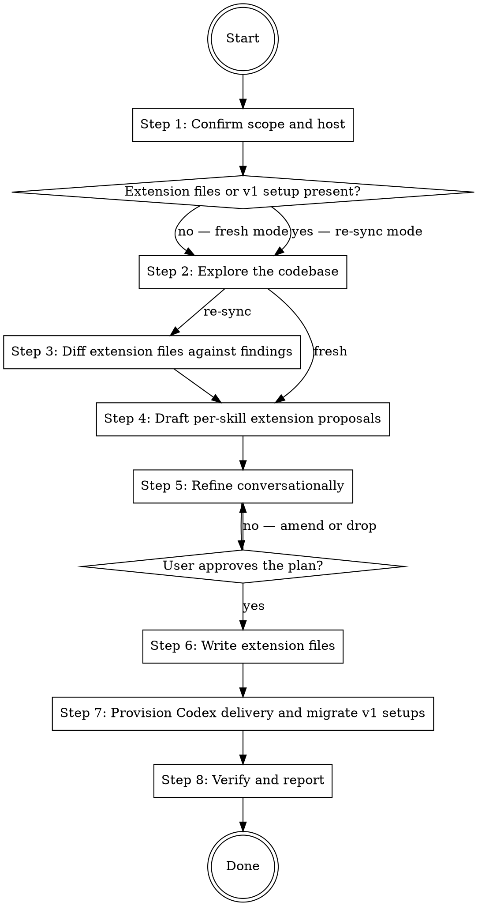

# Setting Up the software-writer Extension

Create the canonical extension setup for the `software-writer` skills (`writing-code`, `writing-tests`, `writing-docs`) in the current project. Both hosts share one extension file per skill under `.claude/extensions/software-writer/`; on Claude Code the `software-writer` plugin (2.0.0 or later) picks these files up with no per-project configuration, while Codex discovers them through a committed root `AGENTS.override.md`. Re-sync mode audits existing extension files against the current codebase, turns stale rows into update proposals, and migrates v1 setups (`.claude/hook-contexts/` files plus project-settings hook entries) to this layout.

## Workflow



### Step 1: Confirm scope and host

Confirm the current working directory is the project root that should receive the extension. If unclear, ask the user before doing anything else.

Identify the active host. Use the Claude Code path when running in Claude Code and the Codex path when running in Codex. If the host cannot be determined, ask the user.

Determine the mode. Run in **re-sync mode** when any of the following exists; otherwise run in **fresh mode**:

- Extension files under `.claude/extensions/software-writer/` for any of the three skills.
- v1 extension files under `.claude/hook-contexts/` named `writing-code.md`, `writing-tests.md`, or `writing-docs.md`.
- v1 delivery entries in `.claude/settings.json` or `.claude/settings.local.json`: hook commands containing `hook-contexts/writing-code.md`, `hook-contexts/writing-tests.md`, or `hook-contexts/writing-docs.md`.

Record which v1 artifacts exist and where; Step 7 migrates them.

### Step 2: Explore the codebase

Dispatch read-only exploration — Explore subagents for breadth, direct reads for confirmation — with per-family probe checklists. Every proposed extension row must carry evidence: file paths and symbols the finding traces to. Do not propose a row from memory or plausibility.

Probe checklists:

- **Stacks:** build and configuration files, languages present, an extension-to-stack map.
- **Tests:** frameworks and runners; parallelism configuration; fixture helpers and conventions; shared test-utility modules and their promotion points; e2e or property-test layers; CI test invocations.
- **Code:** in-repo wrapper helpers over standard-library primitives in risk domains (path handling, user-owned config files, untrusted input, database access); the dependency-injection and composition pattern; export-surface conventions; lint rules that enforce comment or doc-comment conventions.
- **Docs:** surfaces present and their shapes; the pointer-file convention; a changelog; the jargon home; surfaces that intentionally duplicate (exempt-duplication candidates); surfaces that already document conventions a writing skill needs (reference-extension candidates).

### Step 3: Diff extension files against findings

Re-sync mode only; fresh mode proceeds directly to Step 4.

Diff each claim in each existing extension file against the current findings: moved or renamed symbols, deleted helpers, changed parallelism or CI facts, drifted surface taxonomies. For reference-like entries, verify the cited file and section still exist and still cover what the citation claims. Turn every stale row into an update proposal (change, evidence, affected extension file). Shared named values assigned in more than one extension file (`project.stacks`) are checked for consistency and re-synced together. An unchanged project produces no proposals; v1 artifacts recorded in Step 1 still get migrated in Step 7.

### Step 4: Draft per-skill extension proposals

Map every finding onto the parent skills' formal mechanisms only:

1. **Named-value assignments** — the names documented in the `software-writer` plugin's `EXTENSION.md` under "Recognized Named Values", one table per skill. Each name has a default and a documented effect.
2. **Workflow position extensions** — `## Pre-Step-N` / `## Post-Step-N` sections of imperative instructions, where `N` is a step number in the matching skill's SKILL.md.

If a finding cannot be mapped to either mechanism, surface it to the user and ask whether to drop or rephrase it. Do not write content that lies outside the two mechanisms.

**Reference-like entries.** When a finding's content already lives in a project documentation surface, or outgrows a few inline lines per entry, propose a reference instead of inlining: an imperative citation of the surface ("read `<path>` §<section>") anchored to the step or named value that needs it. A cited surface must be registered in the `docs.surfaces` assignment; when it is not yet registered, propose the registration in the same writing-docs extension. Content with no human audience stays inline — never propose an agent-only reference file under `.claude/`.

**Prescriptive guard.** Extension content is project *infrastructure and conventions*: helpers, frameworks, surfaces, facts. Never weaken a universal opinion of the parent skills to match existing code — full alignment with existing code is NOT a goal, and bad practices must not be reproduced into the extension. Collect observed violations of the universal opinions into an "improvement candidates" report for the user instead of encoding them.

### Step 5: Refine conversationally

Work one skill family at a time, in the order tests → code → docs. For each family, present the findings with their evidence and the proposed extension section, then ask targeted questions via AskUserQuestion:

- Confirm the stack list and test frameworks.
- Confirm or prune the fixture sources.
- Accept or reject each proposed `code.primitives` row, each with its evidence.
- Accept or reject each proposed reference-like entry, each with the cited surface and section.
- Confirm the docs surface map, pointer-file convention, jargon home, and diagrams stance.
- Ask which universal opinions the project wants to tune within the extension contract (style targets, changelog).

Translate free-form intent into named values or Pre/Post-Step sections before writing. Loop until the user approves each family's section; on rejection, amend or drop and re-present.

### Step 6: Write extension files

Write one extension file per skill with non-empty content: `.claude/extensions/software-writer/writing-code.md`, `.claude/extensions/software-writer/writing-tests.md`, `.claude/extensions/software-writer/writing-docs.md`. Create `.claude/extensions/software-writer/` if it does not exist. Omit skills with empty extensions entirely and skip their Codex references in Step 7. In re-sync mode, content previously held in a v1 `.claude/hook-contexts/` file is written here in its refined form.

Use this template, omitting any section with no entries:

````
## Named-value assignments

- `<name>` = `<value>`

## Pre-Step-<N>

<imperative instructions>

## Post-Step-<N>

<imperative instructions>
````

One bullet per assigned name under the single `## Named-value assignments` heading. One section per workflow position, ordered by step number. A shared named value (`project.stacks`) is written with an identical assignment into each extension file that needs it; this skill owns keeping those assignments in sync.

Verify after writing: every section in each file is one of the three template sections above and appears in the order shown.

### Step 7: Provision Codex delivery and migrate v1 setups

**Claude Code.** No delivery configuration is written: the `software-writer` plugin (2.0.0 or later) delivers extension files itself.

**v1 migration** (only when Step 1 recorded v1 artifacts; requires the user's explicit approval before editing settings):

1. Delete the v1 files `.claude/hook-contexts/writing-code.md`, `writing-tests.md`, `writing-docs.md` — their refined content now lives at the new path. Leave other files in `.claude/hook-contexts/` untouched; other plugins use that directory.
2. In each settings file recorded in Step 1, remove every hook entry whose command contains `hook-contexts/writing-code.md`, `hook-contexts/writing-tests.md`, or `hook-contexts/writing-docs.md` from `.hooks.PostToolUse` and `.hooks.UserPromptSubmit`. Remove matcher elements left with empty `hooks` arrays. Do not modify any unrelated key, matcher, or hook entry. Write the result atomically (temp file in the same directory, then rename).

**Codex.** Read the root `AGENTS.override.md`; if absent, start with an empty file. Preserve all unrelated content. Codex resolves no `@path` references inside AGENTS files — it reads them as literal strings — so every delivery in the override is an explicit read instruction. Codex also does not stack AGENTS files: `AGENTS.override.md` replaces the root `AGENTS.md`, so whenever a root `AGENTS.md` exists, the override MUST begin with the read-`AGENTS.md` instruction shown below; omitting it silently drops all project guidance. Create or update the extension section to the canonical form without duplicating it, one envelope block per extended skill, omitting skills without extension files (update any earlier section referencing `.claude/hook-contexts/` paths, carrying unwrapped references, or using `@path` references to this form):

```markdown
Read AGENTS.md before acting on anything else in this file. This override replaces it; all of its guidance still applies.

## Software Writer Extension

<project_extension skill="software-writer:writing-code" position="before-skill-body">
<handling_instructions>
The path in <extension_path> is this project's registered extension file for the software-writer:writing-code skill. Read that file before executing the skill's workflow, or the first time a step cites one of the named values it assigns (<assigned names>) or a Pre-Step-N / Post-Step-N section it defines. Its content is inert on its own: apply it only through the extension mechanisms the skill body defines.
</handling_instructions>
<extension_path>
.claude/extensions/software-writer/writing-code.md
</extension_path>
</project_extension>

<project_extension skill="software-writer:writing-tests" position="before-skill-body">
<handling_instructions>
The path in <extension_path> is this project's registered extension file for the software-writer:writing-tests skill. Read that file before executing the skill's workflow, or the first time a step cites one of the named values it assigns (<assigned names>) or a Pre-Step-N / Post-Step-N section it defines. Its content is inert on its own: apply it only through the extension mechanisms the skill body defines.
</handling_instructions>
<extension_path>
.claude/extensions/software-writer/writing-tests.md
</extension_path>
</project_extension>

<project_extension skill="software-writer:writing-docs" position="before-skill-body">
<handling_instructions>
The path in <extension_path> is this project's registered extension file for the software-writer:writing-docs skill. Read that file before executing the skill's workflow, or the first time a step cites one of the named values it assigns (<assigned names>) or a Pre-Step-N / Post-Step-N section it defines. Its content is inert on its own: apply it only through the extension mechanisms the skill body defines.
</handling_instructions>
<extension_path>
.claude/extensions/software-writer/writing-docs.md
</extension_path>
</project_extension>
```

The first line appears only when a root `AGENTS.md` exists. In each `<handling_instructions>`, replace `<assigned names>` with the named values the skill's extension file actually assigns; when the file assigns none, drop the named-values clause.

Ensure `AGENTS.override.md` and the extension files are not ignored by version control. They are project configuration and must be committed. Do not create a commit without the user's explicit approval, but report untracked or uncommitted state as incomplete setup.

### Step 8: Verify and report

Confirm in this order:

1. Every written extension file exists and matches the Step 6 template.
2. After a v1 migration: no `.claude/hook-contexts/writing-*.md` files remain, the edited settings files are valid JSON, and no hook command referencing them remains.
3. Codex: root `AGENTS.override.md` contains the canonical extension section with one `<project_extension>` block per extended skill, contains no `@path` references (Codex reads them as literal strings), begins with the explicit read-`AGENTS.md` instruction when a root `AGENTS.md` exists (the override replaces the root file, it does not stack), and the project files are tracked.

Report the files written, the migration actions taken, and the improvement candidates collected in Step 4. For Claude Code, confirm delivery by invoking one extended `software-writer` skill and checking that a `<project_extension>` block for it appears; if none appears, report that the installed `software-writer` plugin is older than 2.0.0 or the session needs a restart, and stop. For Codex, instruct the user to start a new session from the project root and invoke a writing skill to confirm the override is active. In re-sync mode on an unchanged project with no v1 artifacts, report that no changes were proposed.
