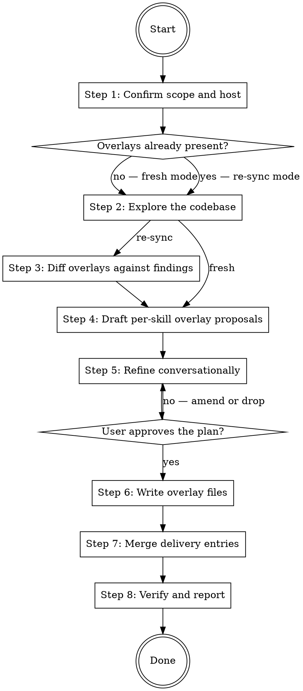

# Setting Up the software-writer Extension

Create the canonical extension setup for the `software-writer` skills (`writing-code`, `writing-tests`, `writing-docs`) in the current project. Both hosts share one overlay file per skill under `.claude/hook-contexts/`; Claude Code delivers them through hooks, while Codex discovers them through a committed root `AGENTS.override.md`. Re-sync mode audits existing overlays against the current codebase and turns stale rows into update proposals.

## Workflow



### Step 1: Confirm scope and host

Confirm the current working directory is the project root that should receive the extension. If unclear, ask the user before doing anything else.

Identify the active host. Use the Claude Code path when running in Claude Code and the Codex path when running in Codex. If the host cannot be determined, ask the user.

Choose the delivery target per host:

- **Codex:** `AGENTS.override.md` in the project root. This file must be committed with the project so Codex can discover the extension from the project root and its subdirectories.
- **Claude Code:** default to `.claude/settings.json`. If only `.claude/settings.json` exists, use it. If only `.claude/settings.local.json` exists, use it. If both exist, ask the user which one to edit. If neither exists, create `.claude/settings.json`.

Check whether overlay files already exist under `.claude/hook-contexts/` for any of the three skills. If any exist, run in **re-sync mode**; otherwise run in **fresh mode**.

### Step 2: Explore the codebase

Dispatch read-only exploration — Explore subagents for breadth, direct reads for confirmation — with per-family probe checklists. Every proposed overlay row must carry evidence: file paths and symbols the finding traces to. Do not propose a row from memory or plausibility.

Probe checklists:

- **Stacks:** build and configuration files, languages present, an extension-to-stack map.
- **Tests:** frameworks and runners; parallelism configuration; fixture helpers and conventions; shared test-utility modules and their promotion points; e2e or property-test layers; CI test invocations.
- **Code:** in-repo wrapper helpers over standard-library primitives in risk domains (path handling, user-owned config files, untrusted input, database access); the dependency-injection and composition pattern; export-surface conventions; lint rules that enforce comment or doc-comment conventions.
- **Docs:** surfaces present and their shapes; the pointer-file convention; a changelog; the jargon home; surfaces that intentionally duplicate (exempt-duplication candidates).

### Step 3: Diff overlays against findings

Re-sync mode only; fresh mode proceeds directly to Step 4.

Diff each claim in each existing overlay against the current findings: moved or renamed symbols, deleted helpers, changed parallelism or CI facts, drifted surface taxonomies. Turn every stale row into an update proposal (change, evidence, affected overlay). Shared named values assigned in more than one overlay (`project.stacks`) are checked for consistency and re-synced together. An unchanged project produces no proposals.

### Step 4: Draft per-skill overlay proposals

Map every finding onto the parent skills' formal mechanisms only:

1. **Named-value assignments** — the names documented in the `software-writer` plugin's `EXTENSION.md` under "Recognized Named Values", one table per skill. Each name has a default and a documented effect.
2. **Workflow position extensions** — `## Pre-Step-N` / `## Post-Step-N` sections of imperative instructions, where `N` is a step number in the matching skill's SKILL.md.

If a finding cannot be mapped to either mechanism, surface it to the user and ask whether to drop or rephrase it. Do not write content that lies outside the two mechanisms.

**Prescriptive guard.** Overlay content is project *infrastructure and conventions*: helpers, frameworks, surfaces, facts. Never weaken a universal opinion of the parent skills to match existing code — full alignment with existing code is NOT a goal, and bad practices must not be reproduced into the overlay. Collect observed violations of the universal opinions into an "improvement candidates" report for the user instead of encoding them.

### Step 5: Refine conversationally

Work one skill family at a time, in the order tests → code → docs. For each family, present the findings with their evidence and the proposed overlay section, then ask targeted questions via AskUserQuestion:

- Confirm the stack list and test frameworks.
- Confirm or prune the fixture sources.
- Accept or reject each proposed `code.primitives` row, each with its evidence.
- Confirm the docs surface map, pointer-file convention, jargon home, and diagrams stance.
- Ask which universal opinions the project wants to tune within the extension contract (style targets, changelog).

Translate free-form intent into named values or Pre/Post-Step sections before writing. Loop until the user approves each family's section; on rejection, amend or drop and re-present.

### Step 6: Write overlay files

Write one overlay file per skill with non-empty content: `.claude/hook-contexts/writing-code.md`, `.claude/hook-contexts/writing-tests.md`, `.claude/hook-contexts/writing-docs.md`. Create `.claude/hook-contexts/` if it does not exist. Omit skills with empty overlays entirely and skip their delivery entries in Step 7.

Use this template, omitting any section with no entries:

````
## Named-value assignments

- `<name>` = `<value>`

## Pre-Step-<N>

<imperative instructions>

## Post-Step-<N>

<imperative instructions>
````

One bullet per assigned name under the single `## Named-value assignments` heading. One section per workflow position, ordered by step number. A shared named value (`project.stacks`) is written with an identical assignment into each overlay that needs it; this skill owns keeping those assignments in sync.

Verify after writing: every section in each file is one of the three template sections above and appears in the order shown.

### Step 7: Merge delivery entries

**Claude Code.** Each overlaid skill needs two entries in the settings target. The command strings below are the authoritative form, shown for `writing-tests` — for `writing-code` and `writing-docs`, substitute the skill name and overlay filename. Treat them as opaque: do not reformat, line-wrap, or reorder keys.

`PostToolUse` matcher entry (matcher value: the exact string `Skill`):

```json
{
  "type": "command",
  "command": "jq --rawfile ctx \"$CLAUDE_PROJECT_DIR/.claude/hook-contexts/writing-tests.md\" 'if .tool_input.skill == \"software-writer:writing-tests\" then {hookSpecificOutput: {hookEventName: \"PostToolUse\", additionalContext: $ctx}} else empty end'"
}
```

`UserPromptSubmit` matcher entry (matcher value: empty string `""`):

```json
{
  "type": "command",
  "command": "jq --rawfile ctx \"$CLAUDE_PROJECT_DIR/.claude/hook-contexts/writing-tests.md\" 'if (.prompt // \"\" | startswith(\"/software-writer:writing-tests\")) then {hookSpecificOutput: {hookEventName: \"UserPromptSubmit\", additionalContext: $ctx}} else empty end'"
}
```

Read the settings target (parse as JSON; if absent, start from `{}`). Ensure:

- `.hooks.PostToolUse` is an array. Find an element whose `matcher` is `"Skill"`. If none, append a new element `{ "matcher": "Skill", "hooks": [] }`. Append each overlaid skill's PostToolUse entry to that element's `hooks` array *only if* no existing entry in that array has the same `command` string.
- `.hooks.UserPromptSubmit` is an array. Find an element whose `matcher` is `""`. If none, append a new element `{ "matcher": "", "hooks": [] }`. Append each overlaid skill's UserPromptSubmit entry to that element's `hooks` array *only if* no existing entry has the same `command` string.

Do not modify any unrelated key, matcher, or hook entry. Write the result atomically (temp file in the same directory, then rename).

**Codex.** Read the root `AGENTS.override.md`; if absent, start with an empty file. Preserve all unrelated content. If a root `AGENTS.md` exists, ensure `@AGENTS.md` appears once before the extension section. Create or update this section to the canonical form without duplicating it, including one conditional reference per overlaid skill and omitting skills without overlays:

```markdown
## Software Writer Extension

Whenever the `software-writer:writing-code` skill is used, apply the project-specific instructions in:

@.claude/hook-contexts/writing-code.md

Whenever the `software-writer:writing-tests` skill is used, apply the project-specific instructions in:

@.claude/hook-contexts/writing-tests.md

Whenever the `software-writer:writing-docs` skill is used, apply the project-specific instructions in:

@.claude/hook-contexts/writing-docs.md
```

Ensure `AGENTS.override.md` and the overlay files are not ignored by version control. They are project configuration and must be committed. Do not create a commit without the user's explicit approval, but report untracked or uncommitted state as incomplete setup.

### Step 8: Verify and report

Confirm in this order:

1. Every written overlay file exists and matches the Step 6 template.
2. Claude Code: the settings target is valid JSON and contains both Step 7 entries for every overlaid skill.
3. Codex: root `AGENTS.override.md` contains the canonical extension section with one reference per overlaid skill, retains root `AGENTS.md` through `@AGENTS.md` when applicable, and the project files are tracked.

Report the delivery target, the files written, and the improvement candidates collected in Step 4. For Claude Code, confirm delivery by invoking one of the overlaid `software-writer` skills. For Codex, instruct the user to start a new session from the project root and invoke a writing skill to confirm the override is active. In re-sync mode on an unchanged project, report that no changes were proposed.
