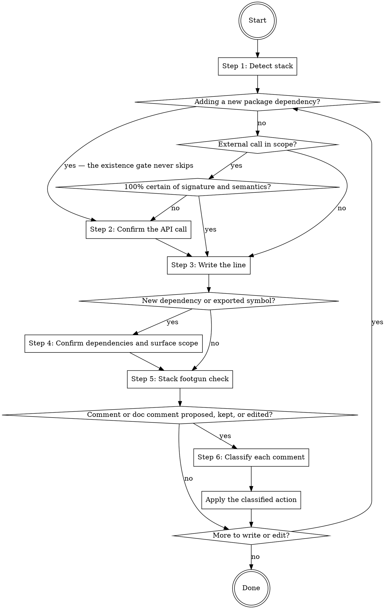

# Writing Code

This skill prescribes what good implementation code looks like. It is a guide for improving code, not a description of what the code currently does. Where existing code diverges from a rule below, the rule wins — fix the code, do not copy the divergence.

## Workflow

The workflow below can be extended by content earlier in context. Two shapes are recognized:

1. **Pre-Step / Post-Step instructions.** Before executing Step N, check whether earlier context contains a section headed `## Pre-Step-N`. If it does, execute its content as additional instructions, then continue with Step N. After Step N, do the same check for `## Post-Step-N`.
2. **Named-value assignments.** The skill body cites certain configuration values by backticked name alongside an inline default (for example `` `code.di_pattern` ``). When such a name appears, check whether earlier context assigns a value to it. If yes, use the assigned value; otherwise use the inline default.

Both checks default to no-op. When earlier context contains no matching section or assignment, the skill runs entirely on the defaults documented inline. Extension content may cite project files by path; read a cited file when the step that cites it runs, not before.

### Step 1: Detect stack

Detect the stack from the file(s) being edited: file extension plus project signals such as `go.mod`, `pyproject.toml`, `tsconfig.json`, or `composer.json`. `project.stacks` overrides detection; default if not otherwise stated: detect from the files and project signals.

Load `references/stacks/<stack>.md` for the detected stack (`go`, `python`, `typescript`, `php`) — only the matching one. For a stack without a reference file, apply the universal rules plus any project content earlier in context.

### Step 2: Confirm the API call

Before writing or editing a call to any non-builtin symbol, ask: am I 100% certain of this symbol's signature, error and async behavior, and edge-case semantics, or am I pattern-matching from training? If not certain, consult the stack's doc tool with the narrowest query that answers the question — the query-shape table lives in the stack reference.

Skip consultation when the call mechanically repeats an idiom already established in the same file, or when the call already compiles or runs with a passing test exercising it.

**New-dependency gate.** Before adding any new package or module dependency, verify the package exists and the name is exact — against the lockfile, the package registry, or vendored sources. Plausible-but-nonexistent package names are a documented failure mode of generated code, and a near-miss name is a supply-chain risk (slopsquatting). Never add a dependency from memory alone: signature certainty skips consultation for existing symbols, never this existence check.

**In-repo primitives.** When the call touches a domain the project wraps — the rows come from `code.primitives`; default if not otherwise stated: none registered — consult the wrapper before reaching for the raw primitive. The doc tool confirms the call works the way you remember; the primitives lookup confirms it is the right call to make at all. Load `references/primitives.md` for the table shape, the decision test, and the missing-wrapper rule.

### Step 3: Write the line

Write the call or edit the line.

### Step 4: Confirm dependencies and surface scope

Skip this step when the edit is a single statement inside an existing function that introduces neither a new dependency nor a new exported symbol.

**Dependency entry shape.** When the line introduces a new dependency — a callable, an external service, configuration, a time source, a randomness source, an output stream — it enters via parameter, option, or constructor field (the Explicit Dependencies principle); wiring concrete implementations together happens at the composition root, not deep in the call tree. Reach-for forms — module-level singletons, free environment reads, inline clock or stdout references — hide test seams and bind shared code to one environment. `code.di_pattern` names the project's concrete pattern; default if not otherwise stated: parameter or constructor injection.

**Caller scope.** Every new exported/public symbol needs at least one non-test caller within the same coordinated unit of work — the smallest closed change that ships together. A symbol whose only callers are tests is Speculative Generality: delete it, keep it module-local, or hold the export until the caller is part of the same coordinated change (YAGNI — holding is acceptable, speculative exports are not). Hyrum's Law makes every export a permanent implicit contract, so an export is a liability the moment it ships. `code.export_conventions` adds project rules such as a package-index re-export surface; default if not otherwise stated: none.

### Step 5: Stack footgun check

Scan the line just written against the stack's footgun catalog in the stack reference. This check is prescriptive: apply it even when nearby code does not. `code.footgun_additions` appends project-specific entries to the catalog; default if not otherwise stated: none.

### Step 6: Classify each comment

Comments split into two tiers with different rules.

**API/doc comments** (doc comments on public symbols) are the interface contract — the abstraction is what the doc comment says it is. Follow the stack's convention; the form and a minimal-correct example live in the stack reference. Compress a doc comment that purely paraphrases the signature to one identifier-prefixed line. Never delete doc comments where project lint requires them; `code.comment_enforcement` names such rules; default if not otherwise stated: none.

**Implementation comments** default to none. Write or keep one only when it carries point-of-use *why* — a hidden constraint, subtle invariant, bug workaround, or deliberate tradeoff the reader cannot infer from the code and types. When deleting code, delete its why-comment too; an orphaned why is dead weight.

For every comment proposed, kept, or edited, load `references/comments.md` and classify it against the six-bucket table, then apply the bucket's action. The reference also carries the load-bearing-why worked shape, the negative-invariant shape, and the banned patterns.
