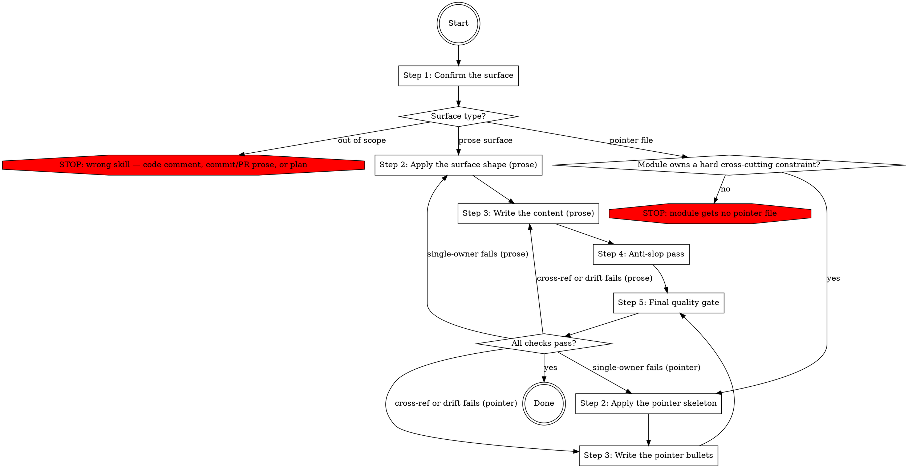

# Writing Docs

This skill prescribes what good repository documentation looks like. It is a guide for improving docs, not a description of what the docs currently are. Where an existing surface diverges from a rule below, the rule wins — fix the surface, do not copy the divergence.

The governing invariant: **every fact has exactly one owning surface**. Other surfaces point at it — `§Heading` by name — they do not restate it. Surfaces registered as exempt-duplication via `docs.surfaces` are the only exception.

## Workflow

The workflow below can be extended by content earlier in context. Two shapes are recognized:

1. **Pre-Step / Post-Step instructions.** Before executing Step N, check whether earlier context contains a section headed `## Pre-Step-N`. If it does, execute its content as additional instructions, then continue with Step N. After Step N, do the same check for `## Post-Step-N`.
2. **Named-value assignments.** The skill body cites certain configuration values by backticked name alongside an inline default (for example `` `docs.pointer_file` ``). When such a name appears, check whether earlier context assigns a value to it. If yes, use the assigned value; otherwise use the inline default.

Both checks default to no-op. When earlier context contains no matching section or assignment, the skill runs entirely on the defaults documented inline.

### Step 1: Confirm the surface

Name the single surface the content belongs on. The default taxonomy — `docs.surfaces` replaces or extends the whole map, including per-surface exemptions from the single-owner invariant; default if not otherwise stated: the built-in taxonomy below.

- **Root README** — pitch, install, usage, pointers into deeper docs. Delegates; never re-explains module contracts.
- **Module README** — Purpose / Public API / Contracts / Quirks / Tests. Short shape (Purpose / Public API / Tests) when the module owns no invariant; no padded "none" sections.
- **Architecture document** (`docs/architecture.md`) — cross-module narrative plus the invariant-to-owner index; cross-cutting policies only when no single module owns the invariant.
- **LLM pointer file** — named by `docs.pointer_file`; default if not otherwise stated: `CLAUDE.md` (alternative `AGENTS.md`; `none` disables the pointer branch entirely).
- **Changelog** — only when `docs.changelog` registers one; default if not otherwise stated: none — do not create a changelog surface.

Code comments, commit messages, PR descriptions, and procedural plans or specs are out of scope — STOP and use the owning skill for that content.

### Step 2: Apply the surface shape

**Prose branch.** Load `references/surface-shapes.md` for the fixed shape of the target surface: the README shapes, the Handled / Refused / Not covered contracts skeleton, the §Limitations anti-pattern, the architecture-document layout, and the changelog discipline. The shape is not yours to refine mid-edit.

**Pointer branch.** The existence gate comes first: the module must own at least one hard cross-cutting constraint an editor must know before changing code. A ceremonial pointer file is noise that erodes trust in every pointer file — a module without such a constraint gets no pointer file (STOP). Load `references/pointer-file.md` for the skeleton, the bullet discipline, the per-bullet decision test, and the worked pairs. When the project maintains both the `CLAUDE.md` and `AGENTS.md` conventions, apply the companion-file rule (one file owns the content, the other is a one-line include; the reference carries it); the project's overlay names which file owns the content.

### Step 3: Write the content

**Prose branch.** Apply while writing, not retroactively: sentences ≤25 words averaging 12-17; paragraphs ≤4 sentences; active voice predominant; headings predict their content (vague headings rot `§` cross-refs); project jargon defined once at `docs.jargon_home` — default if not otherwise stated: `docs/architecture.md` — and never re-defined; stack and standard-library vocabulary left undefined; numbers earn their place (delete when "several" loses nothing). `docs.style` overrides the style targets; default if not otherwise stated: the house targets above. `docs.diagrams` sets the diagram stance; default if not otherwise stated: add a diagram only when a table cannot express the relationship. Load `references/writing-style.md` for the keep-vs-strip examples and decision tests.

**Pointer branch.** Write pointer bullets, not prose, per the discipline loaded in Step 2: ≤30 lines total, 3-8 bullets per section, every `## Before editing` bullet ends with `(README §Heading)`, no motivation in bullets, front-load by stakes, identifiers mirror the code.

### Step 4: Anti-slop pass

Skip this step for pointer files — bullet pointers, not prose.

For prose surfaces: dispatch the `human-author:ai-slop-writing-fixer` subagent via the Agent tool with the edited prose as `content`. Replace the draft with the returned `fixed_content`. A non-empty `changes` list means the violations are already corrected — do not re-apply them.

### Step 5: Final quality gate

Three checks over the diff:

**Single-owner.** For each fact in the diff, does another surface already own it? Point or delete the duplicate, keeping the copy on the surface that owns the fact. Surfaces registered as exempt in `docs.surfaces` skip this check.

**Cross-ref integrity.** For every heading renamed in this edit, search `§<old name>` across every surface and update each cross-ref in the same edit.

**Code-vs-claim sweep.** Every contract row and behavior claim in the diff matches what the named code does today. A doc edit that ships drifted is a regression — fix the doc to match current code, or fix the code to match the contract.

Failure edges: a single-owner failure returns to Step 2 of the matching branch; a cross-ref or drift failure returns to Step 3 of the matching branch.
