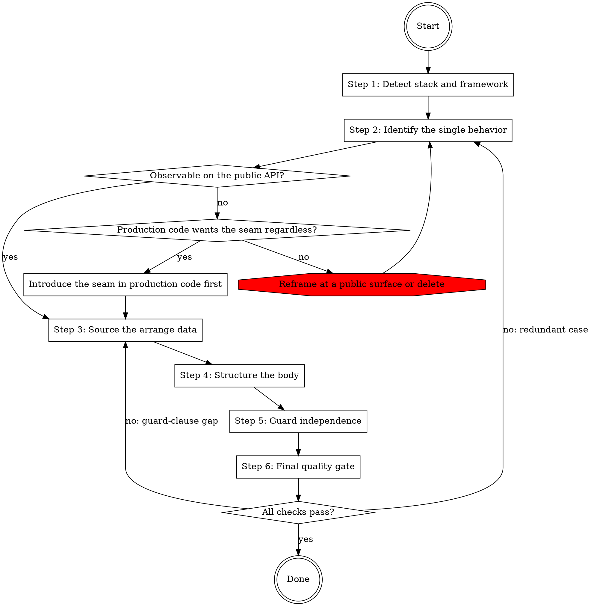

# Writing Tests

This skill prescribes what good tests look like. It is a guide for improving tests, not a description of what the tests currently are. Where an existing test diverges from a rule below, the rule wins — fix the test, do not copy the divergence.

## Workflow

The workflow below can be extended by content earlier in context. Two shapes are recognized:

1. **Pre-Step / Post-Step instructions.** Before executing Step N, check whether earlier context contains a section headed `## Pre-Step-N`. If it does, execute its content as additional instructions, then continue with Step N. After Step N, do the same check for `## Post-Step-N`.
2. **Named-value assignments.** The skill body cites certain configuration values by backticked name alongside an inline default (for example `` `tests.parallelism` ``). When such a name appears, check whether earlier context assigns a value to it. If yes, use the assigned value; otherwise use the inline default.

Both checks default to no-op. When earlier context contains no matching section or assignment, the skill runs entirely on the defaults documented inline. Extension content may cite project files by path; read a cited file when the step that cites it runs, not before.

### Step 1: Detect stack and framework

Detect the stack from the file(s) being edited: file extension plus project signals such as `go.mod`, `pyproject.toml`, `tsconfig.json`, or `composer.json`. `project.stacks` overrides detection; default if not otherwise stated: detect from the files and project signals.

Then detect the **test framework** within that stack, because the rules below differ per framework, not per language. Read the dependency manifest and the test configuration, and confirm against an existing test file's imports; the framework a project declares is authoritative over the one its file extensions suggest. `tests.frameworks` names the project's frameworks and runners; default if not otherwise stated: detect as described. When a project runs more than one framework (a unit runner plus an end-to-end runner, or a legacy suite alongside a current one), select per file being edited.

Load the matching reference — `references/stacks/<stack>/<framework>.md`:

| Stack | Framework references |
|---|---|
| `go` | `stdlib-testing.md`, `testify.md`, `ginkgo-gomega.md` |
| `python` | `pytest.md`, `unittest.md` |
| `typescript` | `vitest.md`, `jest.md`, `node-test.md`, `mocha.md` |
| `php` | `phpunit.md`, `pest.md` |

Go's `testify.md` layers on `stdlib-testing.md`: load both when the project uses testify. Every other file stands alone.

When the detected framework has no reference file, apply the universal rules plus any project content earlier in context, and do not substitute a sibling framework's file — framework-specific idioms and isolation models are not transferable.

Each reference states either the version it was written against or that no version pin applies. Check that against the version the project pins before applying a version-gated rule; where they differ, the project's version wins and the rule may not apply.

### Step 2: Identify the single behavior

Articulate the behavior in one sentence using business language. The test name is a paraphrase of that sentence, not of the implementation. If the sentence contains "and", write two tests. If it names an implementation choice (which dependency was called, internal call order, algorithmic decomposition), there is no test to write.

This skill takes the classicist position: verify state through the public API, use real collaborators unless they are awkward to stand up, and reserve test doubles for genuine boundaries (network, clock, external processes). Over-mocking produces change-detector tests — the Fragile Test smell — that break on refactors without any behavior change and pass while the real integration is broken.

When the behavior is real but not observable through the current public API, the workflow branches three ways: introduce a production-code seam so the behavior becomes observable through it — but only when production code wants the injection point regardless of testability, because a seam introduced solely to test through is the same internal-test smell dressed in an option; reframe the test at an existing public surface that already exhibits the behavior; or delete the candidate as implementation detail.

Load `references/behavior.md` to classify the candidate against the do-test / don't-test lists, the carve-outs (validating constructors, error-path tests where the raise or expectation is the act, drift-guard registry-parity tests), and the four seam patterns.

### Step 3: Source the arrange data

A reader of only this test must be able to tell what the inputs are and where they came from — inputs hidden in shared setup elsewhere are a Mystery Guest. Choose one source:

- Fresh temporary filesystem state created by the test, for state the test itself owns.
- A committed fixture file, for inputs of roughly 10 lines or more and for parser/scanner subjects that deserve a representative on-disk shape.
- An inline literal, for single-line inputs and malformed-shape cases where inline is clearer than a dedicated fixture.
- A project fixture helper named by `tests.fixture_sources`; default if not otherwise stated: the universal list above only.

Prefer DAMP over DRY in test code: extract a helper only on the third occurrence of the same 5+ consecutive arrange lines — two occurrences are not yet a pattern. Use descriptive identifiers, never hex blobs or placeholder UUIDs. When construction variation grows, prefer a Test Data Builder over an Object Mother.

`tests.scale_gating` names the project's pattern for production-scale gated tests; default if not otherwise stated: none — do not invent a gated tier.

Load `references/data.md` for the acceptable-vs-flagged source table, the identifier conventions, the helper-extraction rules, and the scale-gating pattern.

### Step 4: Structure the body

Pick the shape: an arrange/act/assert body with the phases separated for 5+ statements, or a table-driven / parametrized case of 2-3 statements per case (idiom in the framework reference). Write the body without conditional logic that picks between assertions; the error-vs-success dispatch carve-out applies only when the success path's assertions are identical across cases.

Assertion scope: multiple assertions are acceptable only when they verify one logical behavior — unrelated claims in one body are Assertion Roulette. Assertion strength: assert the behavior, not volatile exact counts or generated-output snapshots; exact values that are part of a specification stay exact. One outcome per assertion: no OR-ing over outputs, no membership in a set of "acceptable" values when exactly one is correct.

For CLI output, assert in this order and stop at the first level that captures the behavior: exit code → observable effect (file written, record persisted) → a fragment of the text. Parse machine-readable output (JSON, NDJSON) and assert on the parsed structure rather than substring-matching its serialization. Strip ANSI styling before any text assertion.

Name tests in business language and order them happy → variation → config → edge → error.

Load `references/shape.md` for the worked shapes, the carve-out table, the assertion rules, and the CLI-output rules.

### Step 5: Guard independence

Ask: would randomized order, running a single test alone, or parallel execution change the outcome? If yes, the test depends on state outside its body. Four leak vectors: package/module-level mutable state, closure capture across cases, unrestored globals, and wall-clock or randomness feeding an assertion. Non-determinism is acceptable only when it never feeds an assertion; fixed seeds and fixed dates always are.

Tests are hermetic by default: no network, no shared external services, no reads outside state the test created. `tests.parallelism` states the project's parallel-execution facts; default if not otherwise stated: none stated — guard independence as if tests could run in any order and concurrently.

Load `references/independence.md` for the leak vectors, the restoration patterns, the non-deterministic-input tables, and the fixture-scope rules.

### Step 6: Final quality gate

Run two checks after the body is drafted:

**Redundancy.** Every case (table row, parametrized case) and every top-level test covers a unique code path, boundary value, or regression. Key on why the case exists, not on what the input looks like — three cases exercising the same branch with different magnitudes are one case. Before consolidating a case, run the preservation check for regression markers in its name, id, or nearby comments; a marked case stays.

**Guard-clause isolation.** When the test targets one early-return in a function with multiple sequential guards, the arrange must satisfy every guard above the targeted one so the tested guard is the only possible exit. Open the function under test, enumerate its guards, and verify the arrange — otherwise the test passes through the wrong guard and proves nothing.

The preservation table and the guard-clause worked example live in `references/behavior.md`. On a redundancy failure return to Step 2 (the case may be reframable to a unique branch); on a guard-clause failure return to Step 3 (the arrange needs more setup).
