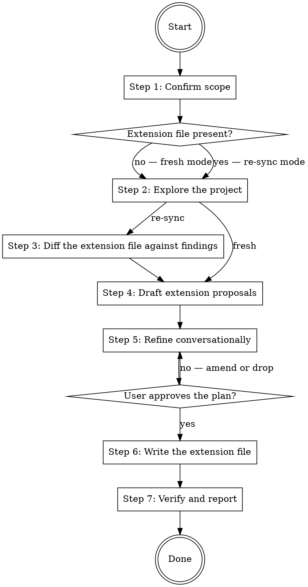

# Setting Up the subagent-orchestrator Extension

Create the extension file for `subagent-orchestrator:orchestrating-subagent-work` in the current project. The `subagent-orchestrator` plugin (2.0.0 or later) delivers the file itself, so no delivery configuration is written. Re-sync mode audits an existing file against the current project and turns stale claims into update proposals.

## Workflow



### Step 1: Confirm scope

Confirm the current working directory is the project root that should receive the extension. If unclear, ask the user before doing anything else.

Run in **re-sync mode** when `.claude/extensions/subagent-orchestrator/orchestrating-subagent-work.md` exists; otherwise run in **fresh mode**.

This skill targets Claude Code. `subagent-orchestrator` ships no Codex manifest, so there is no host branch and no `AGENTS.override.md` to provision.

### Step 2: Explore the project

Dispatch read-only exploration — Explore subagents for breadth, direct reads for confirmation — with the probe checklists below. Every proposed row must carry evidence: the file and line the claim traces to. Never propose a gate command, a protected path, or a banned command class from memory or plausibility; a wrong gate command sends every implementer worker after a command that fails.

Probe checklists:

- **Gates:** build, format, typecheck, lint, and test commands as actually declared — Makefile targets, `package.json` scripts, `taskfile.yml`, `justfile`, `composer.json` scripts, tox/nox config, and the CI workflow files. The CI workflow is the strongest evidence of what the project considers a gate. For each, note whether it needs network, containers, a database, or a device.
- **Fence:** generated output directories and codegen markers, lockfiles, vendored trees, migration history, `.gitattributes` `linguist-generated` entries, and anything a `.gitignore` or build step rewrites. Separately: command classes that touch shared infrastructure, cost money, or need a device — e2e configs, `docker-compose` files, deploy scripts, seed or reset commands.
- **Conduct rules:** rule files and contributor guidance that state conduct a worker must follow beyond the universal three (fail-hard, calibrated honesty, doc drift) — `CLAUDE.md`, `AGENTS.md`, `.claude/rules/`, `CONTRIBUTING.md`.
- **Skill files:** project skills the project expects to govern implementation or review, and which scopes warrant each.
- **Review lenses:** recurring defect classes visible in git history and issue labels; directories with a security or privacy flavor that route away from `gpt-5.6-sol` under the universal table.
- **Checkpoint types and deviation triggers:** recurring work types the routing table has no profile for (schema migrations, generated clients, translation catalogs), and project failure modes the universal trigger list does not name.

### Step 3: Diff the extension file against findings

Re-sync mode only; fresh mode proceeds directly to Step 4.

Diff each claim in the existing file against the current findings: gate commands that no longer exist or changed invocation, protected paths that moved or were deleted, cited files that no longer exist or no longer cover what the citation claims, routing additions for checkpoint types the project no longer runs, and conduct rules whose source file was rewritten. Turn every stale claim into an update proposal with its evidence. An unchanged project produces no proposals.

Report the gate table as the highest-value diff: a stale gate command is the one drift that silently breaks every implementer dispatch.

### Step 4: Draft extension proposals

Map every finding onto the parent skill's formal mechanisms only:

1. **Named-value assignments** — the names in the `subagent-orchestrator` plugin's `EXTENSION.md` under §Recognized Named Values. Each has a default and a documented effect.
2. **Workflow position extensions** — `## Pre-<position>` / `## Post-<position>` sections of imperative instructions, where the position is one of `Preflight`, `Strategy`, `Dispatch`, `Adapt`, `Report`.

If a finding cannot be mapped to either mechanism, surface it to the user and ask whether to drop or rephrase it. Do not write content that lies outside the two mechanisms.

**Append-only guard.** Every list-shaped value adds to its universal list and never shortens it. A finding that amounts to "this project does not need one of the universal banned command classes" or "these conduct rules do not apply here" is not expressible and must not be dressed up as an assignment. Surface it to the user as a disagreement with the plugin, not as a proposal.

**Fence guard.** The consent gate, the deviation check, the halt state, the verification shape, and dual-confirmation closure are outside the contract. A finding that would soften any of them — a project that "always runs codex-less", a checkpoint that "does not need a second confirmer", a fast path that skips the outside-sandbox gate re-run — is refused, not encoded. Collect these with the improvement candidates below.

Do not author `routing.codex_bias = codex-less`. Treat a persistent from-file value as the refused "always runs codex-less" shape and as unable to serve as consent. Explain that codex-less is a per-session consent decision that the user must state directly, and record it among the surfaced decisions rather than in the file.

**Loop-node guard.** `Dispatch` and `Adapt` fire on every pass. Content proposed for either must be safe to repeat; a proposal that assumes it runs once per task belongs at `Strategy` or `Report`.

**Prescriptive guard.** Extension content is project *infrastructure and conventions*: gates, fences, rules, lenses, checkpoint types. Never weaken an orchestration discipline of the parent skill to match how the project currently dispatches work. Collect observed shortcuts into an "improvement candidates" report for the user instead of encoding them.

**Reference-like entries.** When a finding's content already lives in a project file, or outgrows a few inline lines, propose a citation instead of inlining it — and state where it travels. A cited path passes to a worker as required reading in the SKILLS block, not into the session. A gate table stays inline; a full security-review checklist becomes a cited file.

### Step 5: Refine conversationally

Work one family at a time, in the order gates → fence → rules and lenses → routing. For each, present the findings with their evidence and the proposed content, then ask targeted questions via AskUserQuestion:

- Confirm each gate's exact command, and whether it runs inside a `workspace-write` sandbox. For a gate that does not, get its one permitted fallback and whether an independent worker re-runs it outside.
- Accept or reject each protected path and each banned command class, with evidence.
- Confirm which conduct rules and project skill files a worker must receive, and the scope condition for each.
- Accept or reject each proposed routing addition and effort override — an effort override needs the project's own evidence, not a preference. An override on a codex checkpoint sets the invocation flag, so any level is expressible. An override on a claude checkpoint selects one of the agent definitions the parent plugin ships, so only the rungs those definitions carry are expressible — propose a rung none of them carries as an improvement candidate for the parent plugin, not as an assignment. Ask whether the project wants a persistent codex/claude bias; offer `codex-heavy`, `claude-lean`, or none, and record `routing.codex_bias` when selected. Treat this bias as a preference, not a Step 2 probe target, and exempt it from the effort-override evidence requirement.
- Confirm each proposed deviation trigger.

Translate free-form intent into named values or positions before writing. Loop until the user approves each family; on rejection, amend or drop and re-present.

Do not run a gate command to verify it. Confirm it exists in its declaring file, and take sandbox behavior from the user rather than from a trial run.

### Step 6: Write the extension file

Write `.claude/extensions/subagent-orchestrator/orchestrating-subagent-work.md`, creating `.claude/extensions/subagent-orchestrator/` if needed. Use this template, omitting any section with no entries:

````
## Named-value assignments

- `<name>` = `<value>`

## Pre-<Position>

<imperative instructions>

## Post-<Position>

<imperative instructions>
````

One bullet per assigned name under the single `## Named-value assignments` heading. A value with internal structure — the gate table, a routing-additions table — is written as an indented block under its bullet rather than squeezed onto the bullet line. One section per workflow position, ordered as the positions occur in the workflow: `Preflight`, `Strategy`, `Dispatch`, `Adapt`, `Report`.

Verify after writing: every section is one of the three template sections above, every position name is one of the five, and the sections appear in the order shown.

### Step 7: Verify and report

Confirm in this order:

1. The extension file exists and matches the Step 6 template.
2. Every assigned name appears in the parent plugin's §Recognized Named Values table.
3. Every cited file path exists.
4. The file is not ignored by version control. It is project configuration and must be committed. Do not create a commit without the user's explicit approval, but report untracked state as incomplete setup.

Report the file written, the evidence behind each gate row, and the improvement candidates and refused findings collected in Step 4. Confirm delivery by invoking `subagent-orchestrator:orchestrating-subagent-work` and checking that a `<project_extension>` block for it appears; if none appears, report that the installed `subagent-orchestrator` plugin is older than 2.0.0 or the session needs a restart, and stop. In re-sync mode on an unchanged project, report that no changes were proposed.
