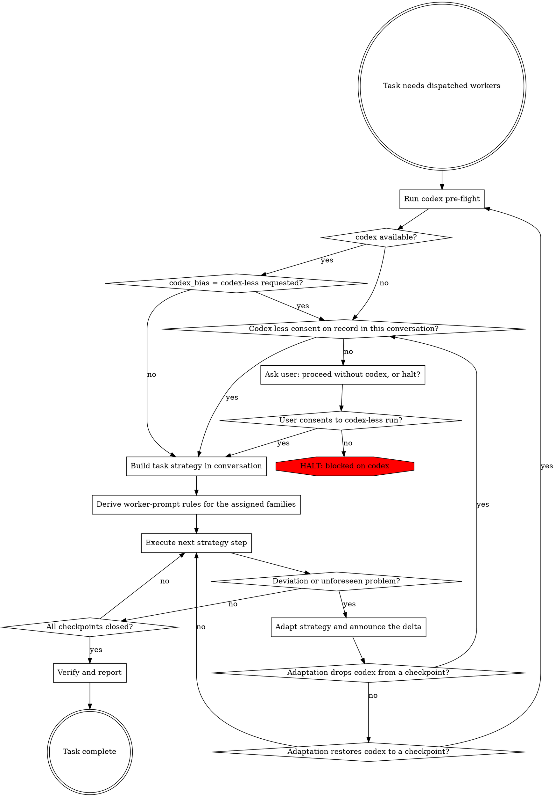

# Orchestrating Subagent Work

The session is the orchestrator: it owns specs, triage, adjudication, git, and write authority — and it conserves its own context by not re-doing worker verification. Workers never write by default; a worker writes only inside a write scope its checkpoint explicitly fences, and every worker-written change is diff-reviewed by an independent worker before it stands. Dispatched workers (codex, sonnet/haiku subagents) are stateless specialists that receive self-contained prompts; their results are confirmed by a second, independent worker, not by the orchestrator. A result confirmed by two workers (codex counts as a worker) is final — the orchestrator verifies something itself only when a deviation routes it there. No worker is dispatched before the workflow below reaches "Execute next strategy step".

## Workflow

The workflow below can be extended by content earlier in context. Two shapes are recognized:

1. **Pre / Post position instructions.** Five nodes carry a position name. Before executing such a node, check whether earlier context contains a section headed `## Pre-<position>`. If it does, execute its content as additional instructions, then continue with the node. After the node, do the same check for `## Post-<position>`. On a looping node, both checks run on every pass.
2. **Named-value assignments.** This skill body and its references cite certain configuration values by backticked name alongside an inline default (for example `` `project.gates` ``). When such a name appears, check whether earlier context assigns a value to it. If yes, use the assigned value; otherwise use the inline default.

| Position name | Node |
|---|---|
| `Preflight` | Run codex pre-flight |
| `Strategy` | Build task strategy in conversation |
| `Dispatch` | Execute next strategy step |
| `Adapt` | Adapt strategy and announce the delta |
| `Report` | Verify and report |

Every other node takes no position, and no named value exists for the verification shape, the consent gate, or dual-confirmation closure. Every list-shaped named value appends to its universal list and never shortens it.

Both checks default to no-op. When earlier context contains no matching section or assignment, the workflow runs entirely on the defaults documented inline. Extension content may cite project files by path; hand a cited path to a worker as required reading rather than reading it into the session, unless a node the session executes itself needs its content.

### Run codex pre-flight

Run this node at task entry before any planning or dispatch, and again whenever an adaptation proposes restoring codex to a checkpoint. Run `codex --version` and `codex login status` via Bash. Codex is available only when both exit zero and the login status reports an authenticated account. A missing binary, non-zero exit, auth error, or known-exhausted quota means unavailable. Quota exhaustion is known only through a failed dispatch or an explicit user statement — suspicion alone does not make codex unavailable. Do not probe with a model request; the pre-flight must not consume quota. Report the pre-flight result in one line before continuing.

### Codex-less consent on record in this conversation?

Search the current conversation for an explicit user statement authorizing work without codex. It counts only when it names this task or is an unqualified general authorization; when it is unclear whether an earlier, narrower statement covers the current task, the answer is no. Only statements in this conversation count — memory files, prior sessions, and inferred preferences never do.

### codex_bias = codex-less requested?

If `routing.codex_bias` is `codex-less`, route to the codex-less consent check even when codex is available. Otherwise continue to strategy.

### Ask user: proceed without codex, or halt?

Use AskUserQuestion. Present exactly two options: proceed without codex (name the substitutions from the routing table that will apply), or halt (restore codex, or drop the codex-less bias). Dispatch nothing — including claude-only workers for "independent" parts of the task — while this question is open. Partial dispatch before consent is a violation.

### HALT: blocked on codex

Report the pre-flight evidence verbatim (command, exit code, error line) and stop the task. Do not start reduced-scope work as a substitute.

### Build task strategy in conversation

Read `references/model-routing.md` and apply it. State the strategy as a compact chat message — never write it to a file. One line per checkpoint; no explanations, no justifications. It covers:

1. The checkpoints (review rounds, fix batches, verification passes, sweeps).
2. Per checkpoint: actor (codex model / agent definition / session), effort, and dispatch order (codex dispatches sequential; read-only subagent fan-outs may run parallel to a background codex run) — plus any routing-table optional pass being omitted.
3. Verification: which independent worker confirms which output. Default shape: every load-bearing result reaches two-worker confirmation — producer plus an independent confirmer. A result is load-bearing when it feeds a write to the tree, a reported conclusion, or a checkpoint closure; when unsure, it is load-bearing. Sandbox gate claims are re-run outside the sandbox by a worker, not the orchestrator.
4. Named assumptions whose breach triggers adaptation — always including any stated deadline or token/quota budget.

Consult `routing.codex_bias` (unset = session decides per the table) when assigning actors, and declare the active bias among the named assumptions.

Dispatch immediately after stating the strategy; do not wait for approval or acknowledgement. The first arrival at this node always produces the full strategy message — including when it was reached through the consent gate. Only on re-entry after a mid-task adaptation does the announced delta serve as the strategy amendment; update the affected checkpoints and do not restate the rest.

### Derive worker-prompt rules for the assigned families

Invoke `llm-author:prompt-engineering` in Ruleset mode once, after the strategy has named its actors. One invocation covers every family the strategy assigned. State all three inputs it resolves so it asks for none:

- The model families in play. `gpt-5.6-sol` / `gpt-5.6-terra` / `gpt-5.6-luna` are GPT-5.6; sonnet and opus definitions are Claude 5; haiku definitions are treated as the Claude 4 generation, an assumption of this plugin rather than a vendor statement.
- The dispatch path per family: a CLI process receiving a piped string for codex, a subagent spawn for a claude worker. Neither takes API parameters.
- The two artifact types to be authored: review prompts and implementer prompts, per `references/worker-prompts.md`.

Require of the ruleset:

- The lever order per family. Claude actors: set the rung first, then adapt wording only where behavior still misses at that rung. GPT-5.6 actors: check the prompt for a missing success criterion, dependency rule, tool-routing rule, or verification loop before raising the rung.
- Leanness as each instruction stated once with contradictions removed — never as a dropped block.
- A worker's verification duties are never removed; they come from `references/worker-prompts.md` and the agent definition.

Write the returned ruleset to a non-permanent file outside the repository and state its path in one line. The file is session-scoped: never committed, never placed under a project path, never reused across tasks.

### Execute next strategy step

Dispatch the current checkpoint's worker per the strategy.

Read `references/worker-prompts.md` before the first dispatch of any checkpoint and build the prompt from it. It governs every worker — codex and subagent alike — and a codex-less run keeps every block; skipping it dispatches implementers with no fence and no gates.

Read the derived ruleset file before building each worker prompt, and phrase the prompt per its rules for the family this checkpoint's actor belongs to. The blocks and their content do not change with the family.

- Codex dispatches: additionally read `references/codex-dispatch.md` for invocation hygiene and the re-validation loop. Codex runs through the CLI only (`codex exec`); never through an MCP transport.
- Subagent spawns: dispatch the agent definition the routing table names; it carries the model and the reasoning effort. Never set an effort on the spawn itself — to change the rung, dispatch a different definition. Spawn the worker without a name — a named worker's report does not arrive on its own. A checkpoint that genuinely needs a named worker states sending the report as that worker's final action inside its REPORT block. When a worker finishes and its report has not arrived, extract only the final assistant block from that worker's persisted transcript under `~/.claude/projects/<project-slug>/<session-id>/subagents/`; never read such a transcript whole. A worker's claim to have sent its report never substitutes for the report itself. Include the honesty and fail-hard directives the worker must follow; workers inherit nothing from the session. The orchestrator stays the sole file writer unless a checkpoint explicitly fences a worker's write scope.
- Any result handed to the user mid-task carries an explicit per-item confirmation status (dual-confirmed / single-source / unverified); single-source and unverified items are labeled as such and never presented as final.

### Deviation or unforeseen problem?

Check after every dispatch returns and whenever new information arrives between dispatches. Deviation triggers: dispatch failure or timeout; codex auth/quota loss; results contradicting a named strategy assumption; scope larger than decomposed; gate failure; a worker returning empty, off-profile, or out-of-scope output; a worker finishing without its report arriving; a worker having written files it was not fenced to write; the user's time or budget constraint no longer fitting the remaining strategy; codex availability regained (a user statement or a restored login) during a codex-less run; producer and confirmer disagreeing about a result; a result unable to obtain its second confirmation; orchestrator-observed evidence of a defect in a result already marked final.

`deviation.additional_triggers` adds project triggers to this list; default if not otherwise stated: the triggers above only. Assignments append — no assignment removes a listed trigger.

### Adapt strategy and announce the delta

Revise the affected checkpoint assignments (actor, model, effort, order, scope) against the routing table. Announce the delta in the conversation — what changed, why, and what stays — before the next dispatch. Never continue silently on a changed plan. For a disputed or unconfirmable result, the escalation ladder is: a third worker, then direct orchestrator verification of that item — the only route by which the orchestrator verifies anything itself. Time pressure adapts scope, never verification: shrinking a checkpoint is announced like any other delta; skipping verification is not an available adaptation. Adaptation may also restore codex to remaining checkpoints; announce a proposed restoration as conditional on its pre-flight, which runs next. If results contradict the task's own premise, stop and surface to the user instead of adapting around it.

### Verify and report

A result confirmed by two workers — producer plus an independent confirmer (codex counts as a worker) — is final; the orchestrator must not verify it again. Before closing, check the confirmation ledger: every load-bearing result is dual-confirmed or was resolved through the deviation path — labeling never substitutes for either; only non-load-bearing results may close as labeled single-source or unverified. Finding verdicts use the vocabulary confirmed / mechanism confirmed / adjudicated / not verified / disputed. The orchestrator's own closing work is adjudication and reporting: merge confirmed results, resolve accepted-decision triage, close checkpoints. Reporting to the user counts as acting: every reported item carries its confirmation status. Report the outcome, per-checkpoint results, and any consent decisions taken.
