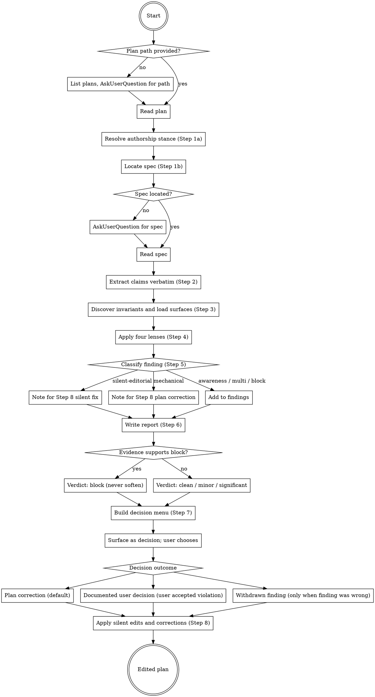

# Reviewing Plans

Critically review an implementation plan against its spec and the current code and docs, then discuss findings with the user and edit the plan to resolve them. Assume the user has not read the plan. Treat every claim, scope boundary, DO, DON'T, and guardrail as a hypothesis. Hunt for counter-evidence.

The plan's author is not present. You owe the plan neither defence nor courtesy.

## Requirements

- **Plan path**: a path relative to the repo root, typically under `docs/superpowers/plans/` or its `archive/` subdirectory.
  - If the argument is missing, list files under `docs/superpowers/plans/` (and `plans/archive/` if present) and ask which one to review via `AskUserQuestion`.
- **Working directory**: the repository root. Plans reference paths that only resolve from there.

## Workflow

### Step 1: Load the plan and spec pair

Read the plan at the provided path.

#### Step 1a: Resolve authorship stance

Whether the user authored the plan and the surrounding code shapes how directly to surface conflicts. Resolve in this order:

1. Look for posture statements already in context. Project surfaces (`CLAUDE.md`, `AGENTS.md`, root docs) sometimes spell out authorship — phrases like "vibe coded", "AI-authored", "single maintainer", "no external consumers" indicate the user has no inherent stake in defending what the plan says. The user may also have stated this directly in earlier turns.
2. If posture documents the user as not the author, treat plan claims as fully external — no courtesy, no defence, hunt for counter-evidence aggressively.
3. If posture documents the user as the author, still treat plan claims as hypotheses; the calibrated-honesty rule applies — do not soften findings under user pressure alone, but frame the surface respectfully of the authorial effort.
4. If posture is silent and the conversation gives no signal, default to the no-stake stance (it produces a more useful review) and note the assumption in the Step 6 report. Ask via `AskUserQuestion` only if a finding's framing materially changes between the two stances.

The stance affects framing only. The four lenses, the classifier, the decision menu, and the verdict ladder are stance-independent.

#### Step 1b: Locate the spec

In order:

1. Search the plan for a line matching `Spec:` or `Spec reference:` whose value points under `docs/superpowers/specs/`. Use that path.
2. If no such line, try `docs/superpowers/specs/<plan-stem>-design.md`, where `<plan-stem>` is the plan filename without extension. This matches the dominant superpowers `brainstorming` output. Preserve any `archive/` subdirectory from the plan path.
3. If that file does not exist, try `docs/superpowers/specs/<plan-stem>.md` (some older pairs drop the `-design` suffix).
4. If neither derived path exists, stop and ask the user for the spec path via `AskUserQuestion`.

Read the spec.

### Step 2: Extract the plan's claims verbatim

Pull out, without paraphrasing:

- Goal or headline outcome.
- Architecture decisions: itemize each design choice in the plan's `**Architecture:**` paragraph (or equivalent prose summary). The paragraph format hides the choice count; expansion forces each choice to stand on its own for audit.
- In-scope items (from the plan, the spec, or both; note where each list comes from).
- Out-of-scope items (same sourcing note).
- DOs and DON'Ts, including any `never ...` sentences and commit-policy statements.
- Guardrails: pre-commit checks, tooling requirements, named caps or limits the plan commits to, expected-commit counts.
- File plan: every file the plan creates, modifies, or deletes.
- Task list: step titles and their affected files.
- Rationale claims: every sentence justifying a scope carve-out, deferred item, design tradeoff, or simplifying choice. Pull verbatim. Tag each as user-attributed (with reference), source-cited (with reference), or unattributed.

Keep line numbers for each extracted claim so the findings can cite them.

### Step 3: Discover invariants and load project surfaces

The skill cannot rely on a hardcoded list of invariants — they vary per project. Discover them per review.

Read the surfaces that carry the project's invariants and module contracts (auto-loaded content is already in context; do not re-read it):

- Root-level posture and rules: `CLAUDE.md`, `AGENTS.md`, root `README.md`, any `docs/architecture.md` / `docs/<project>.md` style files.
- Per-module documentation: for every module the file plan touches, read its `AGENTS.md`, `README.md`, or equivalent. Module roots are project-specific (e.g. `internal/<name>` in Go, `src/<name>` in TS, `app/<name>` in Rails) — discover them from the file plan, not from a hardcoded structure.
- Cross-cutting policy docs the plan references explicitly (security, logging, audit, lock discipline, I/O safety).

Build a per-review invariant list before applying lenses. Look for:

- Numeric or size caps the project guarantees (line caps, request caps, retry limits, timeout limits).
- Concurrency and locking discipline (which lock guards which state, who may hold what concurrently).
- Path and I/O safety guards (rooted paths, archive limits, sanitization rules).
- Module ownership boundaries (which module owns which invariant, where it is enforced).
- Cross-cutting policies (audit logging, redaction, retry semantics, error-handling shape).
- Documentation surfaces describing user-visible contracts (CLI flags, on-disk layouts, public APIs).

Do not pattern-match invariants from prior reviews; the project's invariants live in its own surfaces. Note which of the discovered invariants the plan touches.

### Step 4: Hunt for counter-evidence

Work through these lenses in order. A finding exists when a plan claim conflicts with a source of truth and either changes what the plan does or requires a user decision. Coherent prose is not evidence of correctness; verify every extracted claim against a source before endorsing it.

Step 4 produces the raw counter-evidence pile. Step 5 routes each item to its destination (silent fix, mechanical correction, decision). Do not pre-filter editorial or mechanical items here; the classifier handles them.

#### Plan vs spec consistency

The spec is another document, not ground truth. It can also drift from the code. When spec and plan agree, check both against the current repository.

- Does the plan honor every in-scope and out-of-scope decision the spec made? A plan adding work the spec excluded, or dropping work the spec required, is a finding.
- If the spec names an expected commit count or task count, does the plan match it?
- Where the plan diverges from the spec, is a rationale given, or is the divergence silent?
- Does the plan contradict the spec on architecture, test strategy, or invariant ownership?

#### Plan internal consistency

- Every task's affected files should appear in the file plan, and every file in the file plan should appear in at least one task. Orphans in either direction are findings.
- The architecture summary should be consistent with what the task steps actually do.
- Tasks should be orderable so each lands in its own commit without breaking the project's build or test commands.

#### Rule and invariant violations

Citation is not compliance. If the plan names a rule or invariant, read it yourself and check the planned behavior against its text. Agreement on naming does not mean agreement on semantics.

For every rule in context and every invariant discovered in Step 3, ask whether the plan's work crosses it.

#### Documentation drift

- Plan changes code whose claims live in a module `README.md`, `AGENTS.md`, or top-level architecture doc, without a matching doc edit.
- Plan renames or removes a symbol that docs currently reference.
- Plan shifts an invariant between modules without updating the invariant-to-owner index in the architecture doc.
- Plan adds a new public API without an entry in the owning module's README.
- Tests claim coverage of behavior whose doc statement no longer exists or has moved.

#### Scope and guardrail skepticism

Out-of-scope items hide deferred problems; a clean boundary in prose is still a finding when the deferred problem will bite the in-scope work. The lens is posture-driven: read the project's documented posture in `CLAUDE.md`, `AGENTS.md`, or equivalent surfaces, and apply *its* rules rather than a generic stance.

Read `references/scope-and-guardrail-lens.md` before applying this lens. It contains the audit checklist (carve-outs, BC shims, plugin hooks, DOs/DON'Ts, pre-commit checks, "user did X" assertions), the citable-source test with the list of acceptable sources, and the posture-silent edge case (which routes to `awareness-single-option` / `multi-option` rather than `block-class`). The phrasings list it cites is in `references/planner-invented-phrasings.md`.

### Step 5: Classify findings

Before authoring the report or the decision menu, label every item produced by Step 4. The report and the decision menu draw from the labelled list, not from the raw counter-evidence pile. The labelled list is the auditable evidence the gate ran; write it down before any Step 6 prose.

Five labels:

- `silent-editorial`. The item is a step count, commit count, internal cross-reference, or similar metadata where the underlying intent is clear. Skip the report and the decision menu; queue for silent fix in Step 8.
- `mechanical`. Exactly one correct fix exists and applying it requires no choice (filling a documented gap, completing a list, fixing a stale reference, restoring a missing argument that the surrounding code obviously requires). List in the report under a `Mechanical fixes` sub-list; do not surface as a decision; queue for plan correction in Step 8.
- `awareness-single-option`. Only one resolution is viable and the user benefits from awareness of the choice. The example shape is rule-citation withdrawal: the plan cites a rule that does not exist; the user should know before the citation is removed. List in the report and present as a single-option decision in Step 7.
- `multi-option`. Two or three viable options exist, each a concrete edit, none of which contradicts a cited rule, posture, or spec line. List in the report and present as a multi-option decision in Step 7.
- `block-class`. The plan is fundamentally inconsistent with the spec or with a cited rule. List in the report, drive the verdict to `block`, and present resolution options in Step 7.

#### Routing rules and banned substitutions

Routing is by *whether a choice exists*, not by surface heuristics the agent might find natural. The following substitutions are banned:

- Severity does not affect routing. A linter failure or a static-analysis failure is `mechanical` if exactly one fix exists. The bug being real does not make the fix a choice.
- Wording-correctness type does not affect routing. Technically wrong wording (a misnamed mechanism, a wrong verb chain) is `silent-editorial` if the underlying intent is clear. The gate is "intent clear vs. unclear", not "stylistically wrong vs. technically wrong".
- Available-option count does not affect routing. "I only have one fix in mind" is not a license to use `awareness-single-option`. That label is reserved for shapes where the user benefits from awareness (rule-citation withdrawal and similar), not for items where the agent ran out of alternatives. If only one fix is viable and the user gains nothing from awareness, the label is `mechanical`.
- Confidence and downstream visibility do not affect routing. `low-confidence:` is a Step 6 annotation that attaches to a Step 5 label, not a substitute for one. A real behavior change with two or three viable concrete-edit resolutions is `multi-option` whether or not the finding is low-confidence and whether or not current tests catch it.

### Step 6: Report

Output in this order. Use plain bullets, not bold-title-colon bullets. No em or en dashes.

1. **Summary**: one sentence, 25 words or fewer, on what the plan does.
2. **What the plan claims**: the extracted goal, in-scope, out-of-scope, DOs and DON'Ts, and guardrails, each as a short verbatim bullet with a `plan:<line>` or `spec:<line>` reference. Group by category. This is where the user who did not read the plan learns what is in it.
3. **Findings**: grouped under four headings: `Consistency`, `Rule and invariant violations`, `Documentation drift`, `Scope and guardrail skepticism`. List items labelled `awareness-single-option`, `multi-option`, or `block-class` from Step 5. For each finding:
   - What the plan says, with a `plan:<line>` or `spec:<line>` reference.
   - What conflicts, with a reference to the rule file, spec line, code symbol, or doc paragraph that contradicts it.

   Append a `Mechanical fixes` sub-list of items labelled `mechanical`, each with a plan reference and a one-line description of the fix. Items labelled `silent-editorial` do not appear in the report.

   If a finding is low confidence, add `low-confidence:` to its Step 5 label and explain the uncertainty. `low-confidence:` is an annotation; the Step 5 label still drives Step 7 promotion. Do not pad the list; an empty category is better than filler. On a re-review after prior fixes, `clean` with empty Findings is the correct output, not a hunt for trivial conflicts to justify the run. The skill being invoked is not evidence that something is wrong; manufactured findings dilute the signal and waste the user's attention.
4. **Verdict**: exactly one of
   - `clean`: no findings worth raising. Only legitimate after all four lenses in Step 4 have run; absence of conflicts in a single lens is not grounds for `clean`.
   - `minor`: small corrections; proceed once they land.
   - `significant`: needs discussion before execution.
   - `block`: fundamentally inconsistent with spec or rules; do not execute as written.

   The verdict maps to the evidence, not the tone. Do not soften `block` to `significant` or `significant` to `minor` because the plan looked thoughtful. If the evidence supports `block`, the verdict is `block`.

If Step 1a defaulted to the no-stake stance because posture was silent, note that assumption near the top of the report so the user can correct it before reading findings.

### Step 7: Decision menu

Consolidate the labelled findings from Step 5 into a numbered decision list. Items labelled `awareness-single-option`, `multi-option`, or `block-class` become decisions; items labelled `mechanical` or `silent-editorial` are handled in Step 8 and do not appear here. Combine decisions whose resolutions are coupled, so the user does not pick contradicting halves.

For each decision:

- One-sentence framing of the choice, citing the originating finding by category and short tag.
- 2-3 options for `multi-option` and `block-class` items; one option for `awareness-single-option` items. Each option is a concrete edit to the plan, spec, or code. Reject abstractions like "reconsider scope". Reject options whose tradeoff is "violates a cited rule, posture, or spec line". An option that contradicts the source the skill itself cites is not an alternative; it is a forbidden path. Removing the last viable alternative should trigger a Step 5 reclassification (likely to `mechanical` or `awareness-single-option`), not a single-option fabrication here.
- When a finding exposes a deeper structural problem the plan scoped out, include the structural-fix option. Do not omit it because it is larger or touches more files. When the carve-out's source is a forward reference to a plan that does not yet exist, the structural-fix option must be "land it in this plan now". A vapor reference is not a valid deferral.
- One short clause per option stating its tradeoff. Frame size or breakage honestly; do not bias the language toward the smaller option.
- A recommended option with the reason. Recommend the option that produces the cleanest end state for the project as documented by its posture, not the smallest diff or the safest deferral. "Would touch fewer files", "would be safer to defer", "minimizes risk", and "keeps this PR small" are valid recommendation reasons only when the project's posture rewards them; check before reaching for them.
- A label: `must-decide` when execution blocks on the choice, or `defer-ok` when the plan can land with the decision deferred.

The user did not read the plan and may not know the code. Frame each option so it stands without prior context.

### Step 8: Apply decisions and edit the plan

For each decision, apply the user's chosen option to one of these outcomes:

- Plan correction. Edit the plan in place to remove the violation, fix the reference, restore the omitted scope, or update the file plan or doc-update list to honor the rule, spec, or current source. This is the default outcome.
- Documented user decision. When the user explicitly chooses to keep a violation (rule break, scope carve-out, skipped guardrail, deviation from an established pattern), record the decision in the plan at the point of violation, not as a separate footnote. Use a single line attributing the decision to the user with the date and the reason. Example: `Note: user accepted skipping retry on 2026-04-29; the operation is idempotent and the caller surfaces failure to the user.` These notes are the only legitimate form of "deliberate" attribution; pre-existing claims without such a note are not grandfathered.
- Withdrawn finding. Only when the discussion exposes that the finding itself was wrong (misread plan line, stale rule citation). Record nothing in the plan.

Apply the items labelled `silent-editorial` and `mechanical` in Step 5 in the same pass: off-by-one counts, stale internal step references, miscounted lists, missing arguments the surrounding code obviously requires, and similar items where the fix is unambiguous. These need no user confirmation.

Edit the plan with the `Edit` tool. Apply every chosen decision and every silent or mechanical fix from Step 5; do not skip either. After all decisions are applied, re-state the verdict if any of the resolutions changed it.
