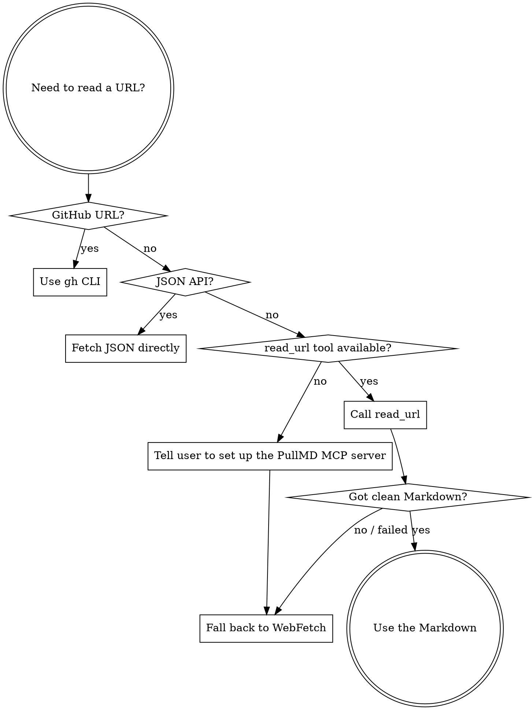

# Fetching Web Content with PullMD

Fetch web pages, documents, and YouTube videos as clean Markdown with the `read_url` tool of the PullMD MCP server. The server already knows its instance — this skill never needs the URL.

## Decision flow



## Pre-flight

Before relying on PullMD, confirm the `read_url` tool of the PullMD MCP server is in your available tools. If it is not, the server is not registered or authenticated in this session — tell the user to register it (`claude mcp add --transport http <name> <instance>/mcp`) and, if the instance requires auth, authenticate via `/mcp`. Until then, fall back to WebFetch for web pages; documents and YouTube have no WebFetch equivalent, so report the gap instead.

## Parameters

`read_url` takes `url` (required) plus these optional parameters:

| Param           | Default  | Notes                                                                          |
| --------------- | -------- | ------------------------------------------------------------------------------ |
| `comments`      | `true`   | Include Reddit comments. Ignored for non-Reddit URLs.                          |
| `comment_depth` | `3`      | Reddit comment nesting depth (1–10).                                           |
| `comment_limit` | none     | Cap on top-level Reddit comments (1–500). Reddit returns ~200 without a cap.   |
| `frontmatter`   | `false`  | Prepend a YAML metadata block (title, source, quality, …).                     |
| `nocache`       | `false`  | Bypass the cache and re-fetch from source.                                     |
| `extractor`     | auto     | Force `readability` / `trafilatura` / `playwright` instead of the auto choice. |
| `pdf_ocr`       | `false`  | High-quality OCR for PDFs (table-grade output; needs a server-side OCR key).   |
| `yt_timecodes`  | `links`  | YouTube transcripts: `links` (clickable), `plain` (`[MM:SS]`), `none`.         |
| `yt_chunk`      | —        | YouTube transcript block size in seconds; `0` = per original snippet.          |
| `lang`          | `de`     | Language for the comments-section header (`de` or `en`).                       |

### Examples

```
read_url(url="https://example.com/blog/why-we-migrated")
read_url(url="https://www.reddit.com/r/homelab/comments/1ab2c3d/topic/", comment_depth=5)
read_url(url="https://example.org/research/whitepaper.pdf", pdf_ocr=true)
read_url(url="https://example.com/app/dashboard", extractor="playwright")   # force full render of a JS-heavy page
read_url(url="https://example.com/status", nocache=true)                    # fresh, uncached
```

## Tips

- `frontmatter=true` adds a metadata block (title, source, extraction quality, and — for Reddit/media/YouTube — author, date, duration, token usage).
- For a JS-heavy page that came back thin, set `extractor="playwright"` to force a full render.
- `list_recent` lists recently fetched URLs (and their share ids); `get_share` re-fetches a prior result by its 8-hex share id. Both are tools of the PullMD MCP server.
- If `read_url` returns poor output or fails, fall back to WebFetch for web pages — documents and YouTube have no WebFetch equivalent, so report the failure instead.
