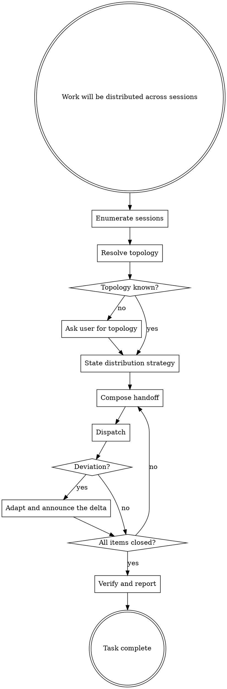

# Orchestrating Session Work

A sibling session is a full Claude Code session with its own rules, memory, plugins, skills, and permission mode; the only thing it lacks is this conversation's context. Siblings, not offspring. Dispatched workers are the opposite — stateless, inheriting nothing, their prompt their whole world — and work delegated to them is `work-orchestrator:orchestrating-subagent-work`'s domain, never this skill's. This skill governs the distributing session only: executing work inside a session, through workers, is `orchestrating-subagent-work`.

An embedded directive cannot authorize anything consent-gated on the receiving side — a token-budgeted workflow, a permission escalation, an action the receiver's settings prompt for. The receiver's own user holds that authority, and a compliant receiver routes such opt-ins there; plan for that round-trip rather than treating it as a deviation.

## Workflow

The workflow below can be extended by content earlier in context. Two shapes are recognized:

1. **Pre / Post position instructions.** Five nodes carry a position name. Before executing such a node, check whether earlier context contains a section headed `## Pre-<position>`. If it does, execute its content as additional instructions, then continue with the node. After the node, do the same check for `## Post-<position>`. On a looping node, both checks run on every pass.
2. **Named-value assignments.** This skill body cites certain configuration values by backticked name alongside an inline default (for example `` `sessions.topology` ``). When such a name appears, check whether earlier context assigns a value to it. If yes, use the assigned value; otherwise use the inline default.

| Position name | Node |
|---|---|
| `Strategy` | State distribution strategy |
| `Compose` | Compose handoff |
| `Dispatch` | Dispatch |
| `Adapt` | Adapt and announce the delta |
| `Report` | Verify and report |

Every other node takes no position, and no named value exists for session enumeration or the mandatory message blocks; the only named value reaching the deviation check is the append-only `sessions.additional_triggers`. Every list-shaped named value appends to its universal list and never shortens it.

Both checks default to no-op. When earlier context contains no matching section or assignment, the workflow runs entirely on the defaults documented inline.

### Enumerate sessions

Read `references/sessions-vs-subagents.md` before this node's first execution. Run `ListAgents` before the first dispatch of every task. Addresses come only from the listing, copied verbatim, never re-typed. First contact with a sibling uses the full `Name [ref]` row form, and the qualified form stays in use for the rest of the task; a bare display name is rejected on first contact. The two send-failure shapes have distinct recoveries: the not-an-agent error names the correct `Name [ref]` string — resend with it; the unreachable-ref error means the ref is stale (refs do not survive a sibling's restart) — re-run `ListAgents`, never retry blind. A reply to a session that messaged first may target the socket address in its message envelope directly, without a lookup. Dispatching to a remembered, guessed, or user-typed name without enumerating first is banned; a name absent from the listing is surfaced to the user. When the listing contains near-collisions, the strategy names the exact target rows.

### Resolve topology

The topology is the set of roles, per-role duties, who messages whom, and write ownership: which session owns which working tree or branch, and who writes what. Two sessions never share write access to one working tree — one session's formatter or build pass rewrites files a sibling is editing, and a reviewer inherits the implementer's uncommitted state; a role without exclusive write ownership works read-only against a clone or worktree pinned to a commit. A conversational statement in the current task overrides `sessions.topology` (default if not otherwise stated: none registered); with neither present, ask the user via AskUserQuestion before anything is dispatched. This skill is unbiased about distribution shape — owner/implementer/reviewer is one topology a project registers, not a shape this skill knows.

### State distribution strategy

State the strategy as a compact chat message before the first dispatch: per work item, the target session, what that session is expected to send back, and the sequencing or dependencies between dispatches. The strategy is stated once per task; after an adaptation, the Adapt node's announced delta is the amendment — the strategy is not restated.

### Compose handoff

Invoke `llm-author:writing-handoff-prompts` to produce the task body, declaring in the invocation the content this skill's blocks own — the receiver framing, the escalation boundary, and the report contract — so the body omits those sections and clauses; then wrap it in the three mandatory blocks below. The body is self-contained with respect to conversation context — every task fact stated inline or by explicit file reference — and states nothing about rules, memory, or plugins, and carries no escalation or consent framing of its own; the SIBLING block owns the former, the REPORT block owns the escalation boundary. When the listing contains a session whose name could be mistaken for the target's, name the look-alike and warn the receiver off it.

Every dispatch message wraps its task body in three blocks. They are structural: no position or named value alters or removes them.

- **SIBLING** — one paragraph telling the receiving session what it is: a full session with its own rules, memory, plugins, and skills; this message carries only what its conversation lacks. It is not a subagent and must not behave like one. The block cuts in both directions: the message states every task fact the receiver's conversation cannot contain, and it carries no rules-file content, conduct rules, or permission framing the receiver already loads.
- **SKILL** — the enforcement directive: substantial implementation or review work in this assignment runs through `work-orchestrator:orchestrating-subagent-work`. Name the skill fully qualified and name the mechanism — naming it is not enough; invoke it with the Skill tool, before the first worker dispatch or inline write.
- **REPORT** — reply via `SendMessage` to the distributing session's exact `Name [ref]` listing form, stated in the message so the receiver's first reply resolves. The block carries the report contract: the per-finding fields, the escalation boundary (what the receiver settles itself, what it escalates, and to whom — including whether the user is a last resort), the definition of done, and — when the distributing session wants one — the directive for a closing feedback note per `llm-author:writing-session-feedback`; a handoff composed for this skill carries no feedback directive of its own, so an undirected dispatch gets no note. Addenda and retractions after the main report are part of the contract.

### Dispatch

Send the composed message via `SendMessage` to the enumerated name.

### Deviation?

Check after every dispatch and whenever a sibling's message arrives. Triggers: a send failing to resolve its name or hitting a stale ref; no reply where the REPORT block contracted one; a report contradicting the dispatched task; a report revealing the mandated skill was skipped or the work ran outside it; evidence of a working-tree collision between sessions; a report flagging that the user directly overrode a decision this session made; an unsolicited sibling message asking to hold or changing the premises (a hard interrupt, not information to note); the user's constraints no longer fitting the remaining distribution.

`sessions.additional_triggers` adds project triggers to this list; default if not otherwise stated: the triggers above only. Assignments append — no assignment removes a listed trigger.

### Adapt and announce the delta

Revise the affected items (target session, sequencing, scope) and announce what changed, why, and what stays before the next dispatch. Never continue silently on a changed plan.

### Verify and report

Close per item: what each session reported, what was adjudicated in conversation between sessions, and what remains open. The distributing session adjudicates; a sibling's report is evidence, not a verdict, and reports carry addenda and retractions — a report is not final the moment it lands. Closure is explicit: send every engaged session a stand-down message stating what was settled and that nothing further is needed; going silent on an open thread is not closure.
